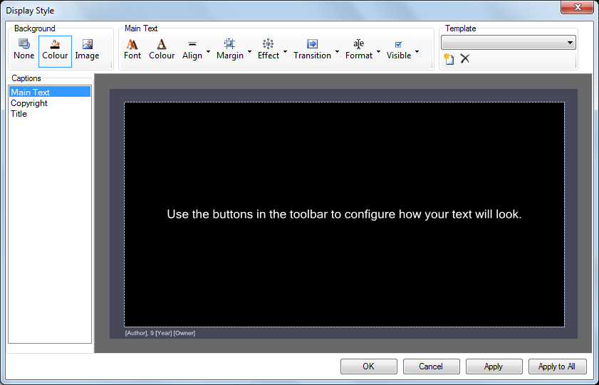

# Song Display Settings

To change to style and format of the presented song words use the Display Editor. There are a lot of similarities between this display editor and the [Text clip](../Text/TextClip.md) so those pages are also worth reading.

## Display Editor
To open the Display Editor either:

- Right-click the Song clip on the Main Dashboard and choose Display Options
- From within a Song Clip edit dialog choose Tools > Display Options 

This dialog will allow you to configure the appearance of your songs. 

There are four main areas

- Toolbar along the top
- Caption list down the left hand side
- Preview in the remainder of the window
- Bottom section buttons

## Captions List
Provides a list of the three elements which make up a song clip. 

- **Main Text** is where the lyrics are shown
- **Copyright** an optional line displaying the copyright information (on by default)
- **Title** an optional line displaying the song title (off by default)

Click on an item to select it and then edit the settings for that caption using the toolbar buttons.

## Toolbar
The toolbar is split into three sections - background, text and template.

### Background
Defines the background for the song. The same background is used for every page/section.

|Item|Description|
|-|-|
|None|Clicking None sets no background at all, ie, fully transparent. This is useful when using multiple layers to present the song lyrics over video clips.|
|Colour|This is the default and the color is black. Clicking the Colour icon will cause a Windows color chooser to present. From there you may choose the desired color. When you choose a color it will also update the preview.|
|Image|Clicking Image allows you to browse to and choose an image to be used. jpg, png, and bmp’ are supported. Note that whatever image you choose will be scaled to fill the screen. Additionally, if the image is configured with a transparent background, the transparency is respected. Animated images are not supported. If you wish to remove an image, click the Colour or None button.|

### Text Formatting
The following settings are applied to each caption (main text, copyright, title) individually. First select a caption from the list on the left and then use these tools to modify it.

|Item|Description|
|-|-|
|Font|Click here to change the Font and style (bold, italic, etc) of the selected caption.|
|Colour|Changes the colour of the selected caption.|
|Align|Clicking this box gives you alignment options for aranging the text within the frame. The icons give an indication of how the text will be laid out.|
|Margin|Allows you to set the four margins (left, right, top, bottom) from the edges of the screen to the selected caption.|
|Effect|This section gives you two effect options - Outline and Drop Shadow. Both are configurable in terms of look and colour.|
|Transition|You can set the time taken for the song words to transition (disolve) from one page to the next. There are four speed options 'No Transition', 'Fast Transition', 'Normal Transition' and 'Slow Transition'.|
|Format|There are|
|Visible| |

### Template

Load

Clicking this icon allows you to load a pre-saved display style template.  
 

Save

Clicking this icon allows you to save a template. You may wish to have different templates that provide different color backgrounds or background images. For example, at Easter there might be one background and at Christmas another. Or perhaps a song targeted at children has one background while a song for adults has another.

## Buttons
Along the bottom of the widow are four buttons.

|Item|Description|
|-|-|
|OK|Close the dialog and keep changes|
|Cancel|Close the dialog and lose changes| 
|Apply| | 
|Apply to All| |
