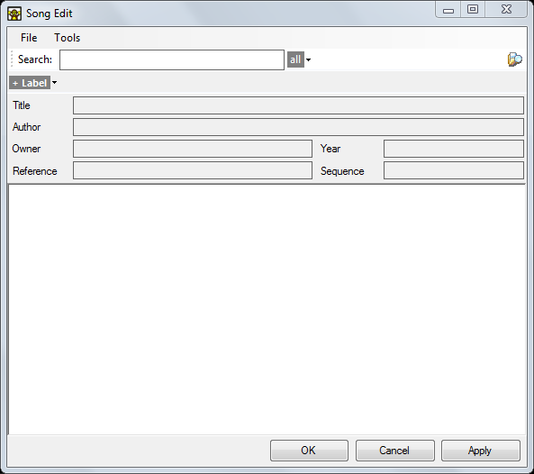
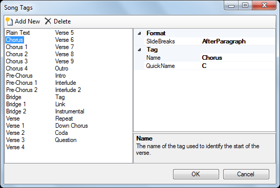

# Creating A New Song

To add a completely new song clip, click an empty desired slot and select Song. Alternatively you can use an [existing song](SongSearch.md) on your computer.

This will present the empty Song Edit dialog.

You can now start typing the lyrics into the large white area however if the song is available online it will be quicker to copy and paste. Make a quick google search for the lyrics of the song you wish to add and copy-paste them into the clip.

Now paste the copied text into the dialog.

At this point we have nearly everything we need. We will rearrange a bit by cutting and pasting elements from the main area into the respective fields above.

What we need to do at this point is to prefix each verse with the proper tag. By prefixing with tags we are configuring things so Screen Monkey knows which elements are to be presented when we play the clip later.

When working with the lyrics there are some special tags that you will use. These tags identify elements of the song. When you create a new Song clip, Screen Monkey has a certain number of tags pre-configured for you.

[View list of default song section tags](SongTags.md)

These tags should be sufficient for most circumstances but you can [edit them](#edit-song-tags) if required.

Place the cursor before each verse and type the tag name to identify the sections of the song, for example 'Verse 1'. Note that after you type the verse tag it becomes bold and shaded.

Case is not important when typing the section tags. Screen Monkey will not care if you type verse 1 or Verse 1. It will recognize the tag either way.

Notice that as you add the tags to indicate the verses the Sequence field becomes populated automatically.

We will examine this in more detail later.

Click File > Save and the Save As dialog should display. Save the Song using an appropriate name and in the location you wish. Note that Screen Monkey is helpful and suggests what is in the Title field.

It's a good idea to save all your songs to a common folder intended for keeping songs. This will come in handy when you use the Search in order to find songs later.

Click OK to dismiss the Song Edit dialog, then click the Song clip to play it. Clear it when finished.

Now you have a song created it's time to [learn how to configure the format and style of the song clip](SongDisplay.md).

## License Text
You may add your CCLI number or copyright details for the songs as follows.

From within the song clip editor choose 'Tools > License Text'.

The Song Options dialog is presented. Enable the Show license text option and type the text into the field provided.

## Edit Song Tags 
There are 33 song tags [available by default](SongTags.md). You may change these tags or add more tags to the list. Each tag requires a Name, which is used in the song body to identify the section, and a single character QuickName identifier which is used in the sequence code. Each tag also has a slide break setting. 

To create your own tags. Open any song for editing and from the Tools menu select 'Song Tags'. You have the option to add new tags or edit old ones. 

