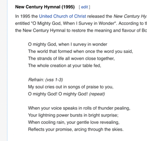
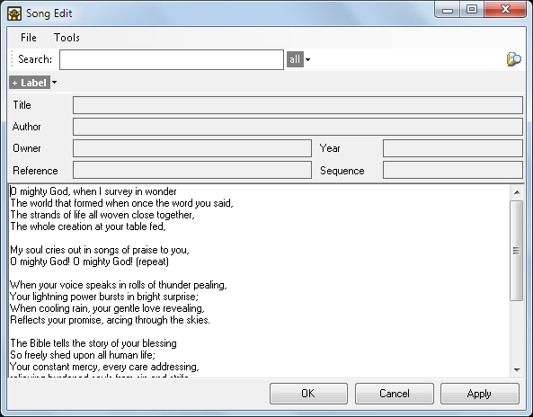
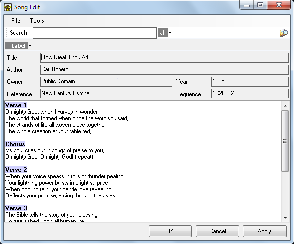
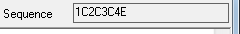
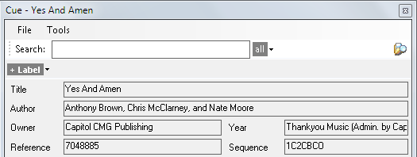
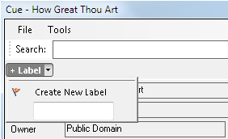
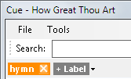
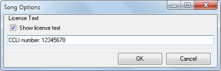

# Creating A New Song

To add a completely new song clip, click any empty Dashboard slot and select Song from the new clip browser. Alternatively you can search for an [existing song](SongSearch.md) on your computer.

The steps for creating a new song are as follows.

1. Type or paste the lyrics
2. Add the section tags
3. Check and update the sequence
4. Add metadata
5. Add labels
6. Save an XML file

These will be explained in detail below.

## 1. Type or paste the lyrics
Initially the song dialog will be empty.

You can start typing the lyrics into the large white area however if the song is available online it will be quicker to copy and paste from a website. Make a quick internet search for the lyrics of the song you wish to add and copy-paste them into the clip. For example, if we search for 'How Great Thou Art' then we find this [wikipedia page](https://en.wikipedia.org/wiki/How_Great_Thou_Art) from which we can copy the lyrics.

Now paste the copied text into the song clip edit dialog.

## 2. Add the section tags
Next we should prefix each verse, chorus or part with a section heading tag. By prefixing with tags we are telling Screen Monkey how elements are to be presented when we play the clip and making it easier for us to jump around the song in playback if required.

There are 33 [song section tags available by default](SongTags.md). Each tag has a Name which is used in the main editor and a single-character QuickName which is used to create the sequence. Each tag also has a slide break setting. These tags should be sufficient for most circumstances but you can edit them if required.

To create your own tags or edit existing ones open any song for editing and from the Tools menu select 'Song Tags'. 

To add tags to the lyrics place the cursor before each section and type the tag name to identify the section. For example, at the start is `Verse 1`. Note that after you type the tag it becomes bold and shaded. Case is not important when typing the section tags. Screen Monkey will not care if you type `verse 1` or `Verse 1`. It will recognize the tag either way.

As you add the tags to indicate the sections the Sequence field becomes populated with the corresponding QuickName automatically.

## 3. Check and update the sequence
The Song sequence is used to configure how the song sections are presented. As you saw in the previous step the sequence is popualted automatically as you add section names in the body of the lyrics but we may want to edit this sequence.

For example, we may want to repeat the chorus after every verse. Instead of typing out the chrous multiple times in the lyrics we simply tell Screen Monkey to reuse that section. 

Each section tag has a unique single character [QuickName code](SongTags.md). These codes are used to make the sequence. So to display the chrorus after each verse we add a `C` code to the sequence as shown below. The numbers `1234` are the codes for the verses. In this song there are two versions of the chorus, the second chorus has been tagged `Chorus 2` and given an `E` code.

Another use of sequences is to miss out sections. Suppose one week you don't want to sing all the verses. All you need to do is edit the sequence to remove the code and that verse won't appear on screen but it will remain in the song clip for use in the future.

## 4. Add Metadata
Above the main lyrics there are a number of metadata fields which can be populated with information about the song. These fields can optionally be displayed with the lyrics. To update these fields simply type or paste into the text boxes.

Use the [Song Display Style](SongDisplay.md) editor to configure how these fields are presented on screen.

## 5. Labels
When you create Song Clips you have the option to add labels. Labels are a handy way of finding songs later. For example, for a church setting you may wish to define a label of Christmas songs then associate it with all the songs on a Christmas theme. Labels can be very useful when you need to [search for songs](SongSearch.md).

### To associate a label with a song
Click the Label drop-down and either select an existing label or start typing to create a new label.

You may repeat this process to add as many labels as needed.

### To remove a label
A label is removed by clicking on the cross next to the label name.

## 6. Save an XML file
It's a good idea to save all your songs to a dedicated common folder intended for only songs. This will come in handy if you want to use [Song Search](SongSearch.md) to reuse songs later. 

There is no requirement to save songs as separate files. Once they are on the dashboard they are included in the showfile and will reload with Screen Monkey.

If you wish to Save the song simply use the File > Save As option from the menu at the top of the song clip dialog. Save the song using an appropriate name and in the location you wish. 

## License Text
You may add your CCLI number or copyright details for songs. This is a global Screen Monkey setting for your installation and not associated with a particular song.

To edit the license text choose 'Tools > License Text' from any Song clip editor dialog.

The License dialog is presented. Enable the 'Show license text' checkbox and type the text into the field provided.

Click OK to save. In order for the licence to appear on screen it may need to be enabled in the [Song Display Editor](SongDisplay.md).

