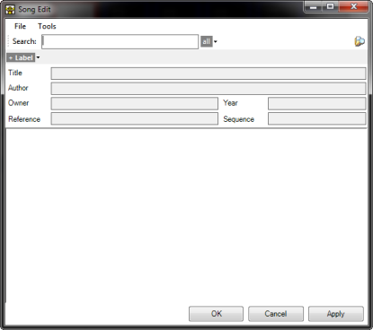
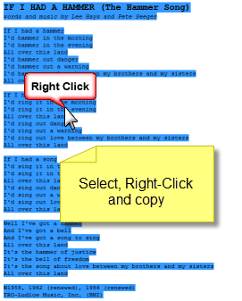
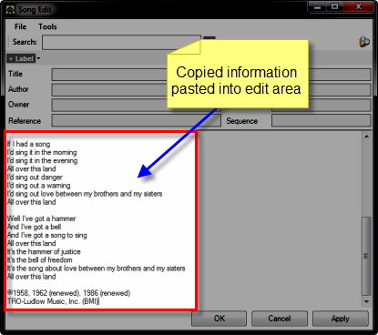
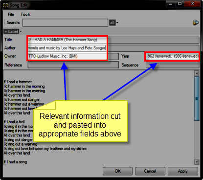
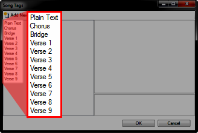
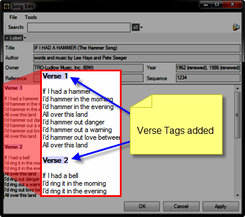
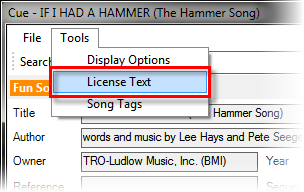
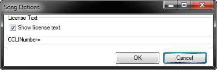

<h1>Creating Song Clips</h1>

To add a Song clip, click or right-click the desired slot and select 
 Song. 

This will present the Song Edit 
 dialog.

For our example, we will add the lyrics to &quot;If I had a hammer&quot;. 
 

A quick Google search turns up the following link:

<a href="http://www.arlo.net/resources/lyrics/hammer-song.shtml" 
								 target="_blank">http://www.arlo.net/resources/lyrics/hammer-song.shtml</a>

Let's perform some copy and paste magic from the web page to the Screen 
 Monkey Song Edit dialog. Select 
 the text on the web page and copy it using Ctrl+C 
 or by Right-clicking.

Now paste the copied text into the dialog.

At this point we have nearly everything we need. We will rearrange a 
 bit by cutting 
 and pasting elements from the main area into the respective fields above.

What we need to do at this point is to prefix each verse with the proper 
 tag. By prefixing with tags we are configuring things so Screen Monkey 
 knows which elements are to be presented when we play the clip later.

When working with the lyrics there are some special tags that you will 
 use. These tags identify elements of the song. When you create a new Song 
 clip, Screen Monkey has a certain number of tags pre-configured for you. 
 To see the available tags click Tools 
 &gt; Song Tags.

the Song Tags dialog is presented.

At this point we are only looking at this dialog in order to see the 
 available tags. Note that the dialog doesn't allow you to choose or insert 
 tags into your Song Clip, it is there only to allow you to view and manipulate 
 the available tags.

Click Cancel to dismiss the 
 Song Tags dialog.

Place the cursor before each verse and type the tag name to identify 
 the verse. Note that after you type the verse tag it becomes bold and 
 shaded.

<table cellspacing="0" border="1" class="hcp5">
	<col>
	<col>
	<tr>
		<td></td>
		<td>Case is not important when typing the Verse tags. Screen Monkey 
		 will not care if you type verse 1 or Verse 1. It will recognize 
		 the tag either way.</td>
	</tr>
</table>

Note that after you add the tags to indicate the verses, the Sequence 
 field becomes populated. 

We will examine this in more detail later.

Click File &gt; Save and the 
 Save As dialog should display. 
 Save the Song using an appropriate name and in the location you wish. 
 Note that Screen Monkey is helpful and suggests what is in the Title 
 field.

<table cellspacing="0" border="1" class="hcp5">
	<col>
	<col>
	<tr>
		<td>
		</td>
		<td>It's a good idea to save all your songs to a common folder 
		 intended for keeping songs. This will come in handy when you use 
		 the Search in order to find songs later.</td>
	</tr>
</table>

Click OK to dismiss the Song 
 Edit dialog, then click the Song clip to play it. Clear it when finished.

Odds are you aren't exactly happy with what you saw. White text on a 
 black background. You may be wondering if you have some options for the 
 way things appear.

<a href="ConfiguringTheAppearance.md">Click here</a> to view the 
 topic on Configuring the Appearance.

&#160;

<h2>License Text</h2>

You may add your <a href="../../../Glossary.md#CCLI">CCLI</a> 
 or copyright details for the songs as follows.

Click the middle mouse button or right-click and choose 
 Edit / Cue to display the Cue dialog.

Click Tools &gt; License 
 Text.

The Song Options 
 dialog is presented.

Enable the Show license text option and type the text 
 into the field provided.

