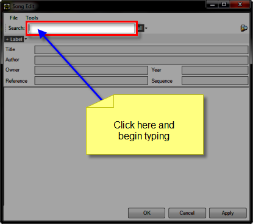
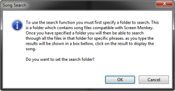
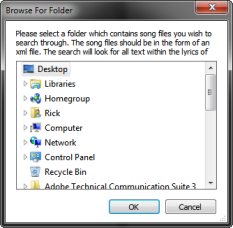
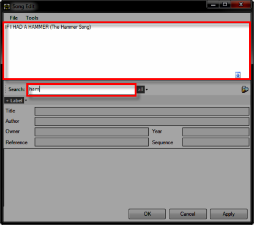
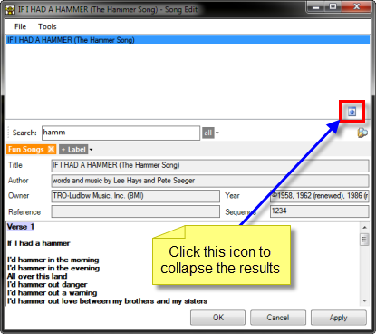
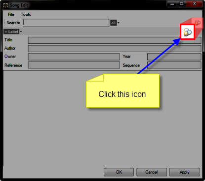
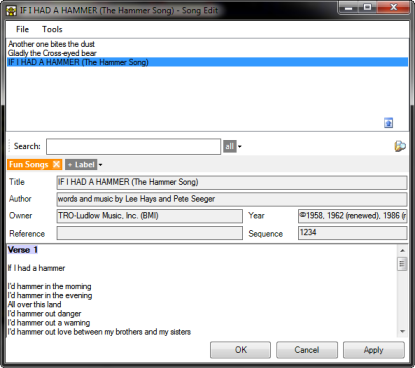
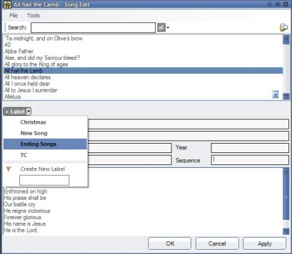
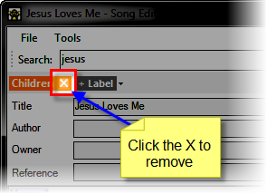

<h1>Searching for Songs</h1>

After you have created and saved many songs you will find yourself needing 
 to periodically search for specific songs while you are creating Song 
 Clips.

<h2>Searching for song text</h2>

Click in the Search field and 
 begin typing the term you are looking for.

If this is the first time you have tried using the Search field, the 
 moment you type a key Screen Monkey will issue the following dialog:

Click OK and Screen Monkey will 
 present the Browse For Folder 
 dialog where you may choose the folder it will then search.

Remember, during the process of <a href="CreatingSongClips.md#SaveLoc">Creating 
 Song Clips</a> you saw a tip that advised to save the songs to a certain 
 folder. This is the folder you should browse to and select. Then click 
 OK.

As you type into the Search field, Screen Monkey dynamically presents 
 songs containing the text.

When you see the song you want, click it and the contents will be loaded 
 into the dialog. Click the icon shown below to collapse the results.

&#160;

<h2>Searching the folder of saved songs</h2>

Sometimes you just want to see a list of the songs in a specific folder 
 and choose the song that way. 

Click the Search icon.

Screen Monkey will present the Browse 
 For Folder dialog where you may choose the folder it will then 
 search.

The songs inside the folder are presented.

When you see the song you want, click it and the contents will be loaded 
 into the dialog. Click the icon shown below to collapse the results.

&#160;

<h2>Search Label Filter</h2>

The song label filter allows you to narrow the search 
 for a specific song to only those songs associated with the label you 
 apply. This provides an easy means to categorize your songs. You may want 
 to apply a label such as &quot;Christmas Songs&quot; so you can search 
 for only songs for Christmas.

The labels may be added to the search by clicking on the 
 labels to the right of the search field and selecting the label you want 
 to add. A label is removed by clicking on the cross next to the label 
 name.

