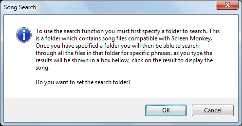
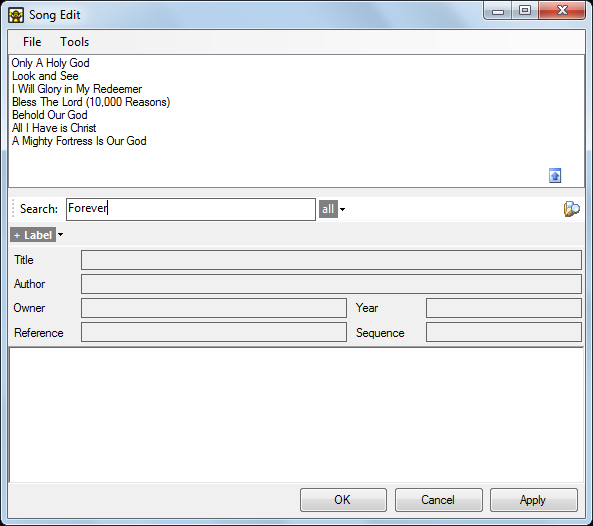
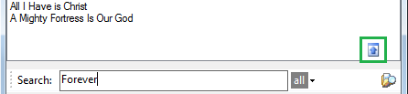
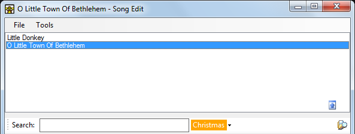

# Searching for Songs

After you have created and saved many songs you will find yourself needing to  search for specific songs to reuse them in Song Clips. The search feature looks at the contents of all your song files and is therefore easier than using the file open method which requires you to know the filename of the song you require. 

## Setting a search folder
The first time you try to type a search you will be asked to specify a folder containing Screen Monkey format XML song files. These can be files you saved previously or files from another user or computer. You should store all your songs in the same folder, sub-folders are not searched.

After reading the message click OK and then choose the folder you wish to search from the browser.

## Searching for Song Text
Once you have set the search folder you can click in the Search field and begin typing the term you are looking for. As you type into the Search field Screen Monkey dynamically presents songs containing the text. In this example typing 'Forever' has returned 7 songs from 40 available.

When you see the song you want, click on the title in the list and the contents will be loaded into the song editor. Click the blue up arrow icon on the right of the dialog to collapse the results pane.

## Searching with Label Filters
The song label filter allows you to narrow the search to only those songs tagged with the specified label. Labels are added when [creating songs](SongEditor.md).

Labels provide an easy means of categorising your songs. If apply a label such as 'Christmas' you can find songs on the theme of Christmas even if the word Christmas is not in the lyrics or title.

A label may be added to the search by clicking on the 'all' dropdown to the right of the search field and selecting the label you want to include. Once a label is added to the search it is shown in an orange box to the right of the search field.

As shown here you don't have to enter a search text in addition to the label unless you need to narrow the results further. 

