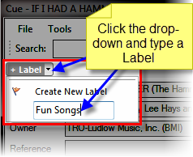
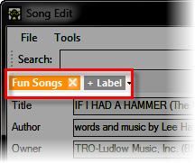
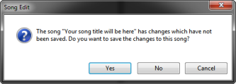

<h1>Working With Labels</h1>

When you create Song Clips you have an ability to create Labels. Labels 
 are a handy way of finding Songs later. For example, for a church setting 
 you may wish to define a Label of Christmas songs. Then associate it with 
 all the different songs using a Christmas theme. Or perhaps Easter. Or 
 perhaps you are presenting song lyrics at a concert. You could define 
 labels by the group that will be performing.

Labels can assist when you need to <a href="SearchingForSongs.md">Search 
 for songs</a>.

&#160;

<h2>To associate a label with a song:</h2>

Open the Cue / Edit dialog for 
 the song by clicking the middle mouse button or right-clicking and choosing 
 Edit / Cue.

Click the Label drop-down and 
 give the song a Label.

Press Enter after typing the 
 Label and the dialog should change a bit.

You may repeat this process to add as many labels as needed.

Click OK after adding the label 
 and Screen Monkey should issue the following prompt:

Click Yes to save the updated 
 song.

After you have added Labels, you may then use them when <a href="SearchingForSongs.md">Searching 
 for Songs</a>.

&#160;

<h2>To remove a label</h2>

A label is removed by clicking on the cross next to the 
 label name.

