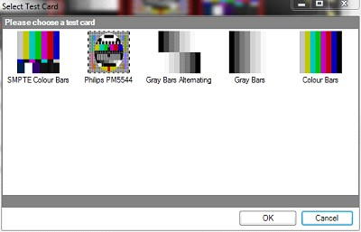

<h1> 
 Test Card Clip</h1>
<h2>What a Test Card Clip does</h2>

The test card clip contains a library of video test cards for use when 
 setting up and calibrating your equipment. The clip allows you to choose 
 from a library of standard cards and display these to the screen. The 
 cards are digitally generated so there is no loss in quality when resizing 
 to different screen sizes.

&#160;

<h2>How to configure a Test Card Clip</h2>

When you first add the clip to a slot you are presented with a dialog 
 allowing you to choose the type of Test Card to use. Click to choose the 
 type and click OK.

As with other clip types, you may specify a <a href="../../tutorials/WorkingWithClips/Transitions.md">Transition</a> 
 or assign the Test Card to a specific <a href="../../tutorials/WorkingWithShows/DisplayLayers.md">layer</a>.

<table style="margin-left: 12px; border-collapse: separate; border-collapse: separate;" 
		 cellspacing="0" border="1">
	<col>
	<col>
	<tr>
		<td></td>
		<td>If you decide you want to use a different test card later, 
		 you must clear the clip and re-add it.</td>
	</tr>
</table>

&#160;

<h2>How to use a Test Card Clip during a show</h2>

As Test Cards are typically used for calibration purposes, you should 
 never see them in a show. However, you might want to play a test card 
 after a show ends in order to simulate a TV station that is off the air 
 and no longer broadcasting. 

To play the clip you simply click it in the Main Dashboard.

&#160;

<h2 class="rvps3">Enhancement History</h2>

<a href="../../releases/Version_3_5.md#TestCard">Version 3.5 - October 
 2010: Test Card Clip added and announced</a>

