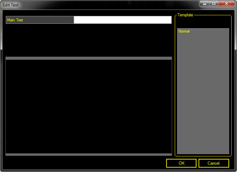
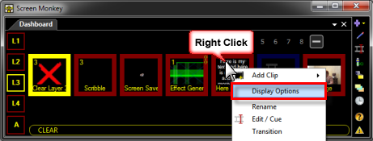
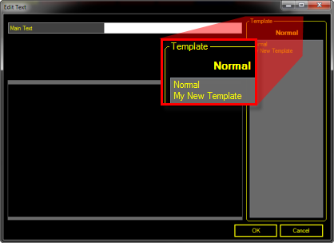
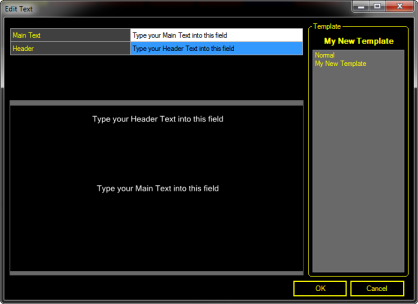

#  Text Clip

## What a Text Clip does

The text clip allows you to display text on the screen using pre-created templates. The text clip is really useful when displaying captions on screen as the text can be easily changed but the template stays the same. A number of different templates can be created and it's simple to switch between the templates when entering the text. Each template can include font, color, background color and image settings.

## How to configure a Text Clip

When you choose to add a Text Clip to a slot you end up with an Edit Text dialog as shown below.

Type some text into the white field and click OK.

At this point it may appear there are precious few ways to manipulate things. Clicking the word Normal in the Template area on the right appears to do absolutely nothing but select the word Normal. The text appears to be centered in the area on the left side and there doesn't appear to be a way to change it. What gives?

Click OK to dismiss the dialog, then Right-click the clip in the Main Dashboard and choose Display Options from the menu.

In Screen Monkey 3.7 new capabilities were added to this clip type. [Click here](TextClipObjects.md) to see more about the objects that may be used.

Click the Save Template icon followed by OK.

Now when you choose to add a Text Clip the dialog should look similar to this:

And when you choose the new Template on the right, you see the fields in the upper left where you add the text.

  

If you wish to change the Template associated with a clip you may right-click the clip and choose Edit / Cue to select a different Template to apply.

You are also able to assign [Effects](../../../tutorials/WorkingWithClips/Effects.md) or [Transitions](../../../tutorials/WorkingWithClips/Transitions.md) to this Clip type.

## How to use a Text Clip during a show

Using this Clip type is just like any other. You click the clip to display it.

## Enhancement History

[Version 3.5 - July 2010: Text Clip added and announced](../../../releases/Version_3_5.md#Text_Clip)

[Version 3.7 - January 2012: Text Clip Objects added and announced](../../../releases/Version_3_7.md#37TextClipObjects)

[Version 3.7 - March 2012: Multi Line in Text Clip](../../../releases/Version_3_7.md#MultiLineInTextClip)