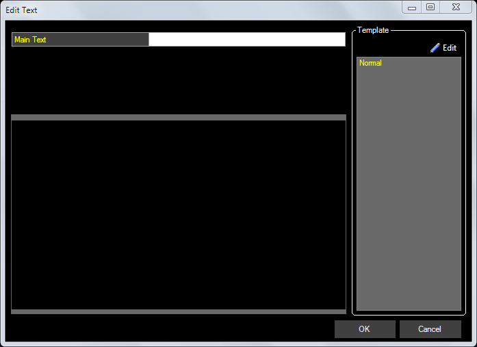
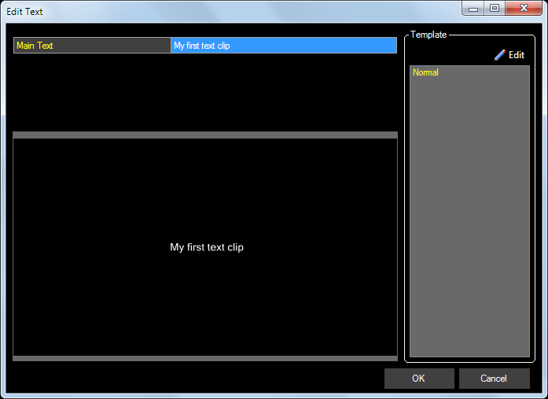
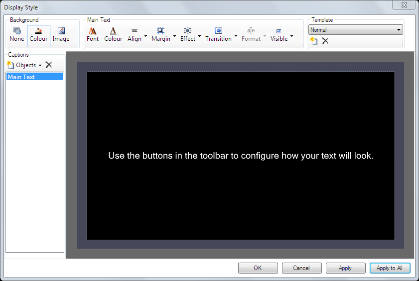

# Text Clip

The text clip allows you to display text and graphics on screen using pre-defined templates. The text clip template is created from a library of [caption objects](TextClipObjects.md) and is really very powerful. Some text clip objects can update their content whilst they are live.

By creating templates the text clip content can be easily changed but the design and layout stays the same. Multiple clips can be created from the same template which makes it quick and easy to have several versions or instances of the same text clip.

A number of different templates can be created and it's simple to switch between the templates when entering the text.

*Note:* Text clip templates are not lost when you create a new show.

## Create a Text Clip
Add a new Text Clip by clicking an empty slot and choosing Text from the new clip dialog. A text dialog will appear with one default template called 'Normal'.

This default template allows you to enter text to be displayed on screen in the white box labelled 'Main Text'. If you type some text and press Enter the preview will update to show how the clip will appear. Click OK and then play the clip to see how it appears on the output.

## Configure a Text Clip
The normal template is a useful starting point. To make changes to the template right-click the clip in the dashboard and choose 'Display Options' from the menu. A display style dialog will open which where you create and edit your templates. 

## Templates
A new template is required when you want to design a new style of text clip. 

- At the right hand side of the toolbar click the 'New' template icon
- Enter a name for your template and press Enter or click OK

Now when you choose to add a Text Clip the dialog should look similar to this:

And when you choose the new Template on the right, you see the fields in the upper left where you add the text.

If you wish to change the Template associated with a clip you may right-click the clip and choose Edit / Cue to select a different Template to apply.

You are also able to assign [Effects](../../../tutorials/WorkingWithClips/Effects.md) or [Transitions](../../../tutorials/WorkingWithClips/Transitions.md) to this Clip type.

## Edit/Cue

## Use a Text Clip during a show
Using this Clip type is just like any other. You click the clip to display it.

