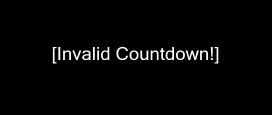
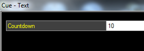

# Text Clip Caption Objects

The text clip contains a library of useful caption objects which can be added to the template to create a text clip for almost any situation. 

## Adding a new Caption Object
From within the Text Display Style dialog click on the 'Objects' button and select the object you wish to add from the dropdown menu. You will be asked to give the new object a name which is used to identify it in the captions list. Enter a name and click OK. The new Cpation will appear in the list and on the preview canvas with its default settings. Objects can be added multiple times with different names and configured differently. 

## Removing a Caption Object
Select the caption and then click the black cross button at the top of the caption list.

## Configure a Caption Object
The caption objects are configured by clicking the caption name in the list on the left of the dialog and then using the Toolbar buttons.

The toolbar buttons which apply to most objects are described here. For all other settings refer to the appropriate section below. 

|Item|Description|
|-|-|
|Font|Click here to change the Font and style (bold, italic, etc) of the selected caption.|
|Colour|Changes the text colour of the selected caption.|
|Align|Clicking this box gives you nine alignment options for aranging the text within the frame. The icons give an indication of how the text will be laid out.|
|Margin|Allows you to set the four margins (top, bottom, left, right) from the edges of the screen to the selected caption frame.|
|Effect|This section gives you two effect options - Drop Shadow and Outline. Both are configurable in terms of opacity and colour. To disable the Drop Shadow set the Opacity to minimum (far left).|
|Transition|You can set the time taken for the caption to transition (disolve) from one page to the next. There are four speed options None, Fast, Medium and Slow.|
|Format|The format options differ for each caption type as described below.|
|Visible|Enable or disable the selected caption from being displayed.|

## Text
Displays formatted text to the screen.

|Item|Description|
|-|-|
|Display Format|The default placeholder string `{0}` means that the text for this object is set in the Edit/Cue dialog of the Text clip. By modifying this string you can add static text saved in the display profile. This is helpful if you want to specify text that won't change and then allow dynamic input of text through the clip Edit/Cue dialog.|
|Example|In the template you might specify the following display format "Next seminar is starting in {0}" and then in each Text clip that you create you input the location text "Downstairs Hall", "Meeting Room 3", etc in the Edit/Cue dialog. When the clip is played {0} is replaced with the text from the Edit/Cue dialog.|

## Live Text
(awaiting more information)

## Image
The image object allows you to insert images and logos into your text clip template.

*Note:* The aspect ratio of the image will be preserved when the clip is played even though it may appear stretched on the preview canvas depending on how you set the margins.

|Item|Description|
|-|-|
|Format Browse|The toolbar format button allows you to browse for an image file. Use the margins and alignment toolbar options to position the image.|

## Countdown
Provides a live onscreen countdown (updated once a second) from the number you specify.

|Item|Description|
|-|-|
|Format|Use a [pattern to format the displayed time](DateTime.md)|
|Reset on Clip Play|
|Count Past Zero|
|Warning|
|Alert|

## Countdown Clock
Generates a realtime onscreen countdown showing the time remaining to the time you specify.

|Item|Description|
|-|-|
|Format|[Use a pattern to format the displayed time](DateTime.md)|
|Reset on Clip Play|
|Count Past Zero|
|Warning|
|Alert|

## Stopwatch
Provides an onscreen clock which counts up from zero in realtime, starting when the clip is played. If you would like to stop the stopwatch but leave the duration on screen then you can use a [Freeze clip](../FreezeClip.md).

|Item|Description|
|-|-|
|Default|HH:mm:ss|
|Format|[Use a pattern to format the displayed time](DateTime.md)|

## Schedule
The Schedule item generates an on screen guide of upcoming events from the data you add to [scheduled clips](../toolbar/schedule.md). This function is especially useful when using Screen Monkey to automate TV channel playout. Between live programmes use this clip to inform viewers what is coming up next. When the clip is live the content will update automatically as the schedule plays.

*Note:* By default scheduled clips are set to 'hidden' so they won't appear in this clip. To show them you must untick the 'Hide' checkbox in the schedule viewer table.

|Item|Description|
|-|-|
|Date Format|[Use a pattern to format the displayed time](DateTime.md). This time is taken from the list scheduled clips. Screen Monkey will automatically pick the next clips to show in the guide.|
|Entry Format|Next to the time you can show the name, title and description of the clip as defined in the [schedule library grid](../toolbar/schedule.md). In a similar way to date and time formatting you have complete flexibilty over the which elements are displayed and in what order. To enable a nice layout you can also add tabs [t] and newline [nl] elements to the format string.|
|Max Display Items|When set to 0 Screen Monkey will fill the schedule caption with as many items as possible. By using this setting you can limit the display to a number of your choice.|
|Time Period|Alternatively, you can limit the display by hours and days.|
|End At Midnight|Don't show events starting tomorrow until the time has passed midnight.|
|Hang Time|Delay the update of the on screen schedule for a specified number of seconds after the scheduled start time of the clip. This is useful when you need to add delays into your automation to accommodate the processing time of other equipment.|

## Text File
Allows you to link the Text clip to a plain text file (.txt) on your computer. Use Windows Notepad or a similar text editor to create and edit these files. While the Text clip is live the linked text file is monitored for changes. Whenever the linked file is updated Screen Monkey will update to show the new content of the file.

|Item|Description|
|-|-|
|Format|Click Format then Browse and select the .txt file you want to link to the Text clip. The display style canvas will update to show the contents of the file.|
 
## Date/Time
Using the Date/Time caption object you can display the current date and/or time live on screen. The format of the time and date is specified using the standard formatting codes and can be combined with static text. 

|Item|Description|
|-|-|
|Default|h:mm:ss tt dd/MM/yyyy|
|Format|[Use a pattern to format the displayed date and/or time](DateTime.md)|

## Notice Pages

## Notice List

Countdown

You can use this object to display a countdown from a specific number.

Once you add the countdown object it will display "\[Invalid Countdown\]" until you configure the text to a start number in the clip's settings.

Once you have set the start number, it will count down from this value each time you play the clip.

[Click here for a step-by-step guide on creating a Countdown clip](../../../tutorials/WorkingWithClips/CreatingACountdown.md).

Countdown Clock

Similar to the Countdown, this object also allows you to display a countdown on the screen. The difference is that with this object, you can specify an end date or time to countdown to. Once you have set the target time, the clip will continuously show a countdown to this time on the screen when the text clip is playing.

When you add the Countdown Clock it will display \[Invalid Time Format!\] till you set the target time. The target time is set through the clips edit panel.

