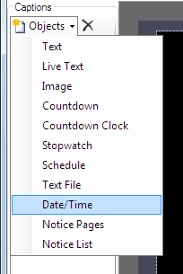
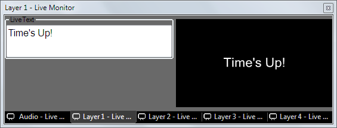
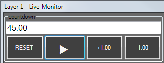

# Text Clip Caption Objects

The text clip contains a library of useful caption objects which can be added to the template to create a text clip for almost any situation. You can use as many caption objects as you need. 

## Adding a new Caption Object
From within the Text Display Style dialog click on the 'Objects' button and select the object you wish to add from the dropdown menu. You will be asked to give the new object a name which is used to identify it in the captions list. Enter a name that will help you remember what this object is for and click OK. The new Cpation will appear in the list and on the preview canvas with its default settings. Objects can be added multiple times with different names and configured differently. 

## Removing a Caption Object
Select the caption and then click the black cross button at the top of the caption list.

## Objects
The text clip caption objects are described in detail below.

### Text
Displays formatted text to the screen.

|Item|Description|
|-|-|
|Display Format|The default placeholder string `{0}` means that the text for this object is set in the Edit/Cue dialog of the Text clip. By modifying this string you can add static text saved in the display profile. This is helpful if you want to specify text that won't change and then allow dynamic input of text through the clip Edit/Cue dialog.|

In the template you might specify the following display format "Next seminar is starting in {0}" and then in each Text clip that you create you input the location text "Downstairs Hall", "Meeting Room 3", etc in the Edit/Cue dialog. When the clip is played {0} is replaced with the text from the Edit/Cue dialog.

### Live Text
Live Text is similar to the text object above except that it can be edited from the live preview monitor when the text clip is live. As you type the output immediately updates. Other options are the same as the standard text object.

### Image
The image object allows you to insert images and logos into your text clip template.

*Note:* The aspect ratio of the image will be preserved when the clip is played even though it may appear stretched on the preview canvas depending on how you set the margins.

|Item|Description|
|-|-|
|Format Browse|The toolbar format button allows you to browse for an image file. Use the margins and alignment toolbar options to position the image.|

### Countdown
Provides a live onscreen countdown *from* the time value you specify. This caption is very useful for displaying a clock to a speaker on stage showing them how long they have remaining for their talk. 

The time to count down from is entered in the preview window of the clip. Enter the time to count from in the format `hh:mm:ss` or `mm:ss` or `ss`. Additionally there are buttons to reset, pause the count, increment and decrement by 1 minute.

The starting value will be remembered if you clear the clip.

|Item|Description|
|-|-|
|Format|Use a [pattern to format the displayed time](DateTime.md). Use the special `!` values to convert the total duration into a specific unit. For example, use `!s` to display 2m:30s as 150 seconds.|
|Reset on Clip Play|Choose to reset the count every time the clip is played or remember the value last displayed.|
|Count Past Zero|Allow the count to continue and show a negative display.|
|Warning|Turn the caption text orange when this time (hh:mm:ss) is passed.|
|Alert|Turn the caption text red when this time (hh:mm:ss) is passed.|

### Countdown Clock
Generates a live onscreen countdown *to* the time you specify.

|Item|Description|
|-|-|
|Format|[Use a pattern to format the displayed time](DateTime.md)|
|Reset on Clip Play|Choose to reset the count every time the clip is played or remember the value last displayed.|
|Count Past Zero|Allow the count to continue and show a negative display.|
|Warning|Turn the caption text orange when this time (hh:mm:ss) is passed.|
|Alert|Turn the caption text red when this time (hh:mm:ss) is passed.|

### Stopwatch
Provides an onscreen clock which counts up from zero in realtime, starting when the clip is played. If you would like to stop the stopwatch but leave the duration on screen then you can use a [Freeze clip](../FreezeClip.md).

|Item|Description|
|-|-|
|Default|HH:mm:ss|
|Format|[Use a pattern to format the displayed time](DateTime.md)|

### Schedule
The Schedule item generates an on screen guide of upcoming events from the data you add to [scheduled clips](../../toolbar/schedule.md). This function is especially useful when using Screen Monkey to automate TV channel playout. Between live programmes use this clip to inform viewers what is coming up next. When the clip is live the content will update automatically as the schedule plays.

*Note:* By default scheduled clips are set to 'hidden' so they won't appear in this clip. To show them you must untick the 'Hide' checkbox in the schedule viewer table.

|Item|Description|
|-|-|
|Date Format|[Use a pattern to format the displayed time](DateTime.md). This time is taken from the list scheduled clips. Screen Monkey will automatically pick the next clips to show in the guide.|
|Entry Format|Next to the time you can show the name, title and description of the clip as defined in the [schedule library grid](../../toolbar/schedule.md). In a similar way to date and time formatting you have complete flexibilty over the which elements are displayed and in what order. To enable a nice layout you can also add tabs `[t]` and newline `[nl]` elements to the format string.|
|Max Display Items|When set to 0 Screen Monkey will fill the schedule caption with as many items as possible. By using this setting you can limit the display to a number of your choice.|
|Time Period|Alternatively, you can limit the display by hours and days.|
|End At Midnight|Don't show events starting tomorrow until the current time has passed midnight.|
|Hang Time|Delay the update of the on screen schedule for a specified number of seconds after the scheduled start time of the clip. This is useful when you need to add delays into your automation to accommodate the processing time of other equipment.|

### Text File
Allows you to link the Text clip to a plain text file (.txt) on your computer. Use Windows Notepad or a similar text editor to create and edit these files. While the Text clip is live the linked text file is monitored for changes. Whenever the linked file is updated Screen Monkey will update to show the new content of the file.

|Item|Description|
|-|-|
|Format|Click Format then Browse and select the .txt file you want to link to the Text clip. The display style canvas will update to show the contents of the file.|
 
### Date/Time
Using the Date/Time caption object you can display the current date and/or time live on screen. The format of the time and date is specified using the standard formatting codes and can be combined with static text. 

|Item|Description|
|-|-|
|Default|h:mm:ss tt dd/MM/yyyy|
|Format|[Use a pattern to format the displayed date and/or time](DateTime.md)|

### Notice Pages

### Notice List
