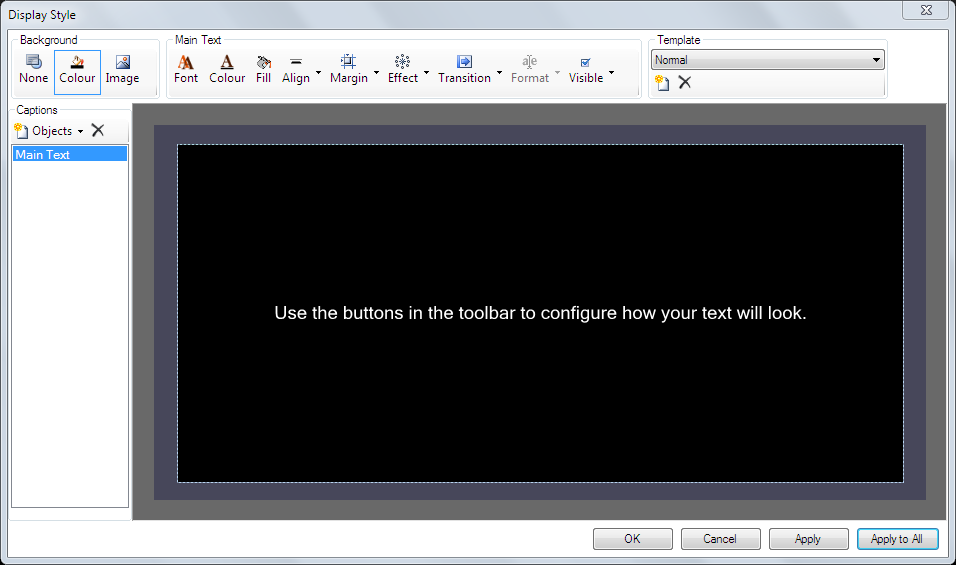

# Text Clip Display Style

The Display Style editor is used for editing your Text Clip Templates. There are four main areas in the dialog.

- Captions list down the left hand side where you create and select [text clip objects](TextClipObjects.md)
- Toolbar along the top which is split into sections for background, selected caption settings, and template
- Preview canvas in the remainder of the window
- Bottom row of buttons

## Captions List
A template will contain one or more caption objects. As you [create caption objects](TextClipObjects.md) they appear in this list. Left click the name of a caption to select it for editing. 

## Toolbar
The toolbar is split into three sections - Background, Caption Settings and Template.

### Background
Defines the background for the clip.

|Item|Description|
|-|-|
|None|Clicking None sets no background at all, ie, fully transparent. This is useful when using multiple layers to present the text objects over video clips.|
|Colour|The default is colour black. Clicking the Colour icon will display a Windows colour picker. From there you may choose the desired background colour.|
|Image|Clicking Image allows you to browse to and choose an image to be used. jpg, png, and bmp’ are supported. Note that whatever image you choose will be scaled to fill the screen. Additionally, if the image is configured with a transparent background, the transparency is respected. Animated images are not supported. If you wish to remove an image, click the Colour or None button.|

### Caption Settings
The middle section of the toolbar allows you to modify the selected text caption object. The caption objects are selected by clicking the caption name in the list on the left of the dialog and then using the toolbar buttons.

The toolbar buttons which apply to most objects are described here. For all other settings refer to the [Text Clip Objects page](TextClipObjects.md). 

|Item|Description|
|-|-|
|Font|Click here to change the Font and style (bold, italic, etc) of the selected caption.|
|Colour|Changes the text colour of the selected caption.|
|Fill|Set a solid background colour for the caption. This fill also has a transparency option.|
|Align|Clicking this box gives you nine alignment options for aranging the text within the frame. The icons give an indication of how the text will be laid out.|
|Margin|Allows you to set the four margins (top, bottom, left, right) from the edges of the screen to the selected caption frame.|
|Effect|This section gives you two effect options - Drop Shadow and Outline. Both are configurable in terms of opacity and colour. To disable the Drop Shadow set the Opacity to minimum (far left).|
|Transition|You can set the time taken for the caption to transition (disolve) from one page to the next. There are four speed options None, Fast, Medium and Slow.|
|Format|The format options differ for each caption type as described below.|
|Visible|Enable or disable the selected caption from being displayed.|

### Template
The currently selected template is shown in the drop down menu. Use the buttons to create a new template or delete the selected template.

## Preview Canvas
The large area in the middle of the dialog shows a preview of how your text clip will look. Depending on the captions in use some placeholder text will be seen because you are viewing the template and the actual data to be displayed is not added until after the clip is created.

## Buttons
Along the bottom of the widow are four buttons.

|Item|Description|
|-|-|
|OK|Close the dialog and keep changes for the current template|
|Cancel|Close the dialog and lose changes| 
|Apply|Make changes to the current template but leave the dialog open| 
|Apply to All|Apply these settings to all text clips using this template in the current show. You will be asked to confirm.|
