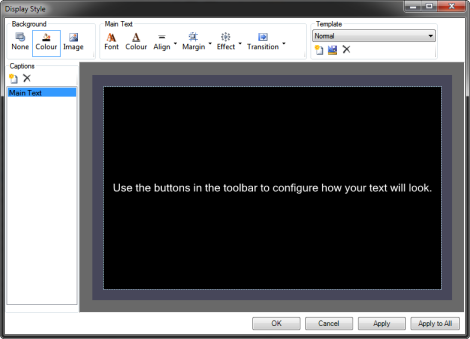
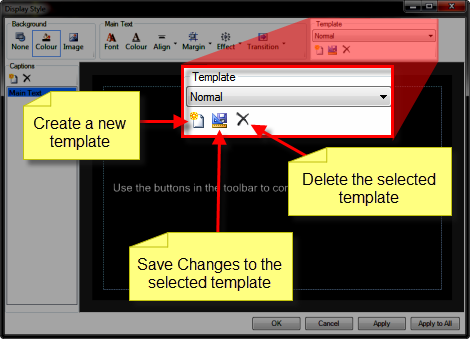
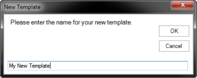
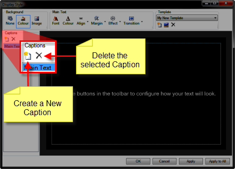
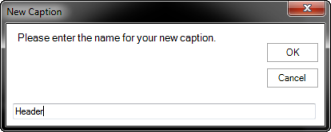
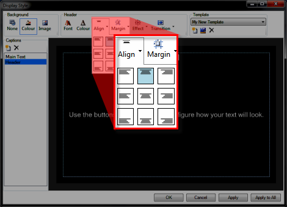

The Display Style dialog should 
 open and offer many options that are used to configure the appearance 
 of the text.

All settings are stored inside Templates. So it's only logical that 
 you would first define a Template and configure it from there. &#160;If 
 you are wondering why the dialog has the different colored areas, <a href="http://en.wikipedia.org/wiki/Title_safe" 
	 target="_blank">click here</a>.

Click the New Template icon.

Type a name to identify the template and click OK.

After you have created the template you need to configure it. Notice 
 that your new template already has a Caption 
 named Main Text. Let's add new 
 Captions. 

Click the New Caption icon.

Type a name to identify the caption and click OK.

You may add any number of captions. Captions simply define where any 
 text assigned to these fields will appear. In the example above, we named 
 our Caption &quot;Header&quot;. As you might imagine, we want the caption 
 to present a heading as well as to be aligned at the top of the display 
 and centered. For this, we select the Header caption in the Captions list, 
 then click the Align icon to choose 
 the desired alignment.

Note that you may also configure the Font, Font color, Margins, Effect 
 and Transition in the formatting area. These options are pretty intuitive 
 and should need no further explanation.

If you look at the Background section, note that your options are:

<table style="margin-left: 24px; border-collapse: separate; border-collapse: separate;" 
		 cellspacing="0" border="1">
	<col>
	<col>
	<tr>
		<td>None</td>
		<td>This option removes any Color or Image that has been selected.</td>
	</tr>
	<tr>
		<td>Colour</td>
		<td>This option allows you to choose a color to be used for the 
		 background.</td>
	</tr>
	<tr>
		<td>Image</td>
		<td>This option allows you to choose an image to be used for the 
		 background. Note that the image will simply be scaled to fit.</td>
	</tr>
</table>
