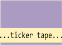
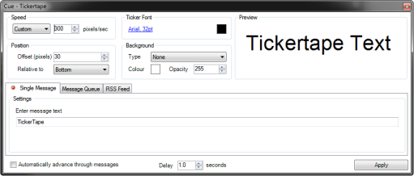

 
# Ticker Tape Clip

The Ticker Tape clip displays some scrolling text and allows you to specify a list of messages to scroll through. This works in much the same way as a news crawl and presents a scrolling bar of text across the screen.

The messages may be pre-configured by the Screen Monkey operator or an RSS or Atom feed may be used to supply the messages.

## Configure a Ticker Tape Clip
Click or Right-click an empty slot and choose Ticker Tape. After clicking OK the slot simply shows Ticker Tape.

Right-click the Ticker Tape Clip and choose Edit / Cue.

The Cue Tickertape dialog is presented.

There are a number of configuration options to choose here.

Type the text you wish to present in the Enter message text field. Most of the other options should be self-explanatory, such as Font, Font Color, etc. But there are some options that do warrant a bit of explanation.

### Speed

- **Pixels/Sec:**

### Position

- **Offset (pixels):** This value allows you to control the vertical position of the Ticker.

- **Relative to:** This allows you to choose whether the Ticker appears at the top of the display or at the bottom.

### Ticker Font

### Background

- **None:** No background appears and only text scrolls across the display  
- **Box:** A background color surrounds only the message and both scroll across the display.
- **Banner:** A background color appears only when the message is scrolling. Once the message finishes scrolling, the background disappears until the message is presented again. At that time the banner will re-appear.  
- **Banner Always:** A background color appears whether the message is present or not.    

- **Colour:** Configures the color used for the background.  
- **Opacity:** Configures the opacity of the background colour. Values are 0-255 with 0 meaning transparent and 255 meaning totally opaque.  

## Single Message tab

## Message Queue tab

This tab allows you to store several messages. For example, perhaps you wish to store the following messages so that you might be able to recall them as needed:  
  

*   Please silence your cell phones
*   Please remember to complete your keynote evaluations
*   Please hold all questions until the end of the discussion
*   Please begin forming lines at the microphones for our Q&A

   
Type your messages into the New message field and press Enter to add it to the queue. To rearrange messages in the queue, click and drag them to their new location. To delete them, click to select and press the Delete key.  
 

### RSS Feed tab

Feed URL

Type the URL used for the feed into this field  

Feed Type

Choose Detect Automatically if you would like Screen Monkey to try and detect the type of feed for you. Otherwise, choose the type of feed. (RSS or Atom)  
 

Format String

What is used here determines the way the feed appears when presented. Click the links to the right to add these to the field.  
 

Refresh Every

This determines the interval at which Screen Monkey will check the Feed URL for any message updates.  
 

### Bottom of dialog

*Automatically advance through messages**

If you have added two or more messages to the Message Queue, the messages will be cycled through the list.  
If a single message has been used on the Single Message tab, it is looped and plays over and over until stopped.

Delay

After each message leaves the screen, the amount of time specified here will elapse before the next message is presented or before the message is repeated (if being looped).

More than one Ticker Tape clip may be configured. the settings are independent and changes to one clip don't affect others. For example, perhaps you want some Ticker Tape messages to have a bright red background while others have a bright yellow background.

## Use a Ticker Tape Clip in a show
Click the Ticker Tape Clip to begin playing. If you have configured multiple messages, right-click and choose Edit / Cue or click the middle mouse button to open the Cue Tickertape dialog. From there you may choose the message to be used by double-clicking the message. You must also click Apply to set it.

If a check mark is cleared in the Messages queue, the clip will play the message followed by Screen Monkey removing the message.

If your Ticker Tape is pointing to an RSS feed, you may right-click the Ticker Tape Clip in the Main Dashboard and choose Update RSS Feed now to refresh. This saves you from being forced to open the Cue dialog.

