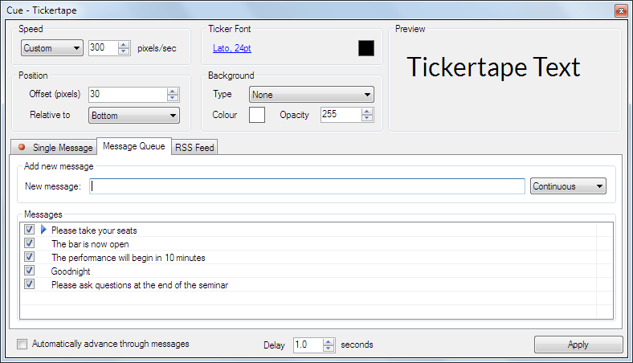
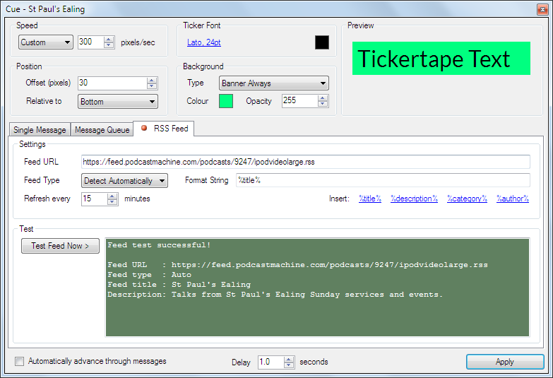

 
# Ticker Tape Clip

The Ticker Tape clip displays horizontally scrolling text on the screen. The text can be typed directly into the clip, selected from a pre-defined list, or retrived from a RSS feed.

More than one Ticker Tape clip may be used in a show. The settings are independent and changes made to one clip don't affect others. For example, perhaps you want some Ticker Tape messages to have a bright red background while others have a bright yellow background.

## Create a Ticker Tape Clip
Click on an empty slot and choose Ticker Tape from the new clip browser. After clicking OK the slot will show the Ticker Tape icon. Right-click on the clip and choose Edit/Cue. The Ticker Tape cue dialog will appear where you can configure the clip.

It is very likely that you will want to put the ticker tape on a layer above any other clips you are using. The layer can be preset by right clicking on the clip and choosing [Layer](../clipSettings/layer.md).

## Configure a Ticker Tape Clip
There are three ways of using the Ticker Tape clip which are shown in three tabs. The top section of the dialog is common to all three tabs.

### Speed

- **Pixels/Sec:** This setting will determine the speed at which the text scrolls across the screen. There are three preset speeds and a custom option where you can specify a number in pixels/second.

### Ticker Font

- **Font:** Click the font name to open a font picker where you can set the text font, style and size for the ticker.
- **Colour:** Click the colour square to open a colour picker where you can set the text colour for the ticker.

### Position

- **Offset (pixels):** This value allows you to control the vertical position of the ticker.
- **Relative to:** This dropdown allows you to choose if the vertical offset is calculated from the top or bottom of the display.

### Background
There are four background types to choose from.

- **None:** No background appears and only the text scrolls across the display.  
- **Box:** A background colour surrounds only the message text and both scroll across the display.
- **Banner:** A background colour appears only when the message is scrolling. When the message finishes scrolling the background disappears until the next message appears.  
- **Banner Always:** A background colour is seen at all times.
    
The background also has options for colour and transparency.

- **Colour:** Configures the color used for the background.  
- **Opacity:** Configures the opacity of the background colour. Values are 0-255 with 0 meaning transparent and 255 meaning totally opaque.  

### More Options
There are two more global options at the bottom of the dialog.

- **Automatically advance through messages:** If you have added two or more messages to the Message Queue, the messages will be cycled. If a single message has been used on the Single Message tab, it is looped and plays over and over until stopped.
- **Delay:** After each message leaves the screen, the amount of time specified here will elapse before the next message is presented or before the message is repeated (if being looped).

## Single Message tab
Type the text you wish to present in the 'Enter message text' field. Click apply to confirm the new text.

## Message Queue tab
This tab allows you to store several messages and either manually choose one or loop through them all automatically. 

Type your message into the 'New message' field. There are two options when adding a message:

- **Continuous:** The message will stay in the list until you manually delete it. 
- **Once:** After the message has been shown it is deleted automatically.

Once you have typed the message at set the option press Enter to add it to the queue. 

- To rearrange messages in the queue click and drag them to their new location. 
- To edit a message in the list double click the text.
- To delete them, click to select and press the Delete key.
- To temporarily stop a message appearing untick the box at the left of the message.

The blue arrow will indicate the next message to be played.

### RSS Feed tab
It is also possible to link the Ticker Tape clip to an online RSS or Atom XML feed.

- **Feed URL:** Type the URL used for the feed into this field  
- **Feed Type:** Choose Detect Automatically if you would like Screen Monkey to try and detect the type of feed for you. Otherwise, choose the type of feed. (RSS or Atom).
- **Format String:** Here you pick the fields in the XML data which will be used for the text displayed. Fields are identified by `%` symbols at either side. Examine the feed you are using to find the field names. You can also add static text.
- **Refresh every:** This setting determines the interval at which Screen Monkey will check the Feed URL for message updates.

## Use a Ticker Tape Clip in a show
Once you have setup the clip as described above click the Ticker Tape Clip icon on the dashboard to begin playing. One of the following will happen depending on the clip settings.

|Mode|Auto Advance Option|Result|
|-|-|-|
|Single Message|Unticked|The message will play once and then the clip will enter a pause state.|
|Single Message|Ticked|The message will loop forever. To stop either click the Ticker Tape clip again to pause or clear the layer.|
|Message Queue|Unticked|The next message in the queue will play and the clip will then enter a pause state. To play the next message in the queue click the clip again.|
|Message Queue|Ticked|Messages in the queue will be played in order and loop forever. Messages withoput a tick will be skipped. To stop click the clip icon again or clear the layer.|
|RSS Feed|Unticked|The first item in the feed will be shown and the clip will then enter a pause state.|
|RSS Feed|Ticked||

If you have configured multiple messages a, right-click and choose Edit / Cue or click the middle mouse button to open the Cue Tickertape dialog. From there you may choose the message to be used by double-clicking the message. You must also click Apply to set it.

If a check mark is cleared in the Messages queue, the clip will play the message followed by Screen Monkey removing the message.

If your Ticker Tape is pointing to an RSS feed, you may right-click the Ticker Tape Clip in the Main Dashboard and choose Update RSS Feed now to refresh. 
