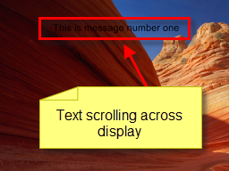

<h1> 
 Ticker Tape Clip</h1>
<h2>What a Ticker Tape Clip does</h2>

The Ticker Tape clip displays some scrolling text and allows you to 
 specify a list of messages to scroll through. This works in much the same 
 way as a news crawl and presents a scrolling bar of text across the screen.

The messages may be pre-configured by the Screen Monkey operator or 
 an RSS or Atom feed may be used to supply the messages.

&#160;

<h2>How to configure a Ticker Tape Clip</h2>

Click or Right-click an empty slot and choose Ticker Tape. After clicking 
 OK the slot simply shows Ticker 
 Tape. 

Right-click the Ticker Tape Clip and choose Edit 
 / Cue.

The Cue Tickertape dialog is 
 presented.

There are a number of configuration options to choose here.

Type the text you wish to present in the Enter 
 message text field. Most of the other options should be self-explanatory, 
 such as Font, Font Color, etc. But there are some options that do warrant 
 a bit of explanation.

<table style="margin-left: 24px; border-collapse: separate; border-collapse: separate;" 
		 cellspacing="0" border="1">
	<col>
	<col>
	<tr>
		<td colspan="2" bgcolor="#C0C0C0">Single 
		 Message Tab</td>
		
	</tr>
	<tr>
		<td colspan="2" bgcolor="#C0C0C0">Position</td>
		
	</tr>
	<tr>
		<td>Offset (pixels)</td>
		<td>This value allows you to control the vertical position of the 
		 Ticker. 
		 &#160;</td>
	</tr>
	<tr>
		<td>Relative to</td>
		<td>This allows you to choose whether the Ticker appears at the 
		 top of the display or at the bottom. 
		 &#160;</td>
	</tr>
	<tr>
		<td colspan="2" bgcolor="#C0C0C0">Background</td>
		
	</tr>
	<tr>
		<td class="hcp4">Type</td>
		<td>None 
		 No background appears and only text scrolls across 
		 the display 
		 &#160; 
		  
		 &#160; 
		 Box 
		 A background color surrounds only the message 
		 and both scroll across the display. 
		 &#160; 
		  
		 &#160; 
		 Banner 
		 
		 A background color appears only when the message 
		 is scrolling. Once the message finishes scrolling, the background 
		 disappears until the message is presented again. At that time 
		 the banner will re-appear. 
		 &#160; 
		  
		 &#160; 
		 Banner Always 
		 
		 A background color appears whether the message 
		 is present or not. 
		 &#160;</td>
	</tr>
	<tr>
		<td class="hcp4">Color</td>
		<td>Configures the color used for the background. 
		 &#160;</td>
	</tr>
	<tr>
		<td class="hcp4">Opacity</td>
		<td>Configures the opacity of the background color. 
		 Values are 0-255 with 0 meaning transparent and 
		 255 meaning totally opaque. 
		 &#160;</td>
	</tr>
	<tr>
		<td colspan="2" bgcolor="#C0C0C0">Message 
		 Queue tab</td>
		
	</tr>
	<tr>
		<td colspan="2">This tab allows you to store several messages. 
		 For example, perhaps you wish to store the following messages 
		 so that you might be able to recall them as needed:  
		 
		
		<ul type="disc">
			<li>Please silence your cell phones</li>
			<li>Please remember to complete your keynote evaluations</li>
			<li>Please hold all questions until the end of the discussion</li>
			<li>Please begin forming lines at the microphones for our Q&amp;A</li>
		</ul>
		&#160;
		 Type your messages into the New 
		 message field and press Enter 
		 to add it to the queue. To rearrange messages in the queue, click 
		 and drag them to their new location. To delete them, click to 
		 select and press the Delete 
		 key. 
		 &#160;</td>
		
	</tr>
	<tr>
		<td colspan="2" bgcolor="#C0C0C0">RSS 
		 Feed tab</td>
		
	</tr>
	<tr>
		<td class="hcp4">Feed 
		 URL</td>
		<td>Type the URL used for the feed into this field 
		 &#160;</td>
	</tr>
	<tr>
		<td class="hcp4">Feed 
		 Type</td>
		<td>Choose Detect Automatically if you would like Screen Monkey 
		 to try and detect the type of feed for you. Otherwise, choose 
		 the type of feed. (RSS or Atom) 
		 &#160;</td>
	</tr>
	<tr>
		<td class="hcp4">Format 
		 String</td>
		<td>What is used here determines the way the feed appears when 
		 presented. Click the links to the right to add these to the field. 
		 
		 &#160;</td>
	</tr>
	<tr>
		<td class="hcp4">Refresh 
		 Every</td>
		<td>This determines the interval at which Screen Monkey will check 
		 the Feed URL for any message updates. 
		 &#160;</td>
	</tr>
	<tr>
		<td colspan="2" bgcolor="#C0C0C0" class="hcp4">Bottom of dialog</td>
		
	</tr>
	<tr>
		<td class="hcp4">Automatically 
		 advance through messages</td>
		<td>If you have added two or more messages to the Message Queue, 
		 the messages will be cycled through the list. 
		 If a single message has been used on the Single 
		 Message tab, it is looped and plays over and over until stopped.</td>
	</tr>
	<tr>
		<td class="hcp4">Delay</td>
		<td>After each message leaves the screen, the amount of time specified 
		 here will elapse before the next message is presented or before 
		 the message is repeated (if being looped).</td>
	</tr>
</table>

&#160;

<table cellspacing="0" border="1" class="hcp5">
	<col>
	<col>
	<tr>
		<td></td>
		<td>More than one Ticker Tape clip may be configured. the settings 
		 are independent and changes to one clip don't affect others. For 
		 example, perhaps you want some Ticker Tape messages to have a 
		 bright red background while others have a bright yellow background.</td>
	</tr>
</table>

&#160;

<h2>How to use a Ticker Tape Clip during a show</h2>

Click the Ticker Tape Clip to begin playing. If you have configured 
 multiple messages, right-click and choose Edit / Cue or click the middle 
 mouse button to open the Cue Tickertape dialog. From there you may choose 
 the message to be used by double-clicking the message. You must also click 
 Apply to set it.

If a check mark is cleared in the Messages queue, the clip will play 
 the message followed by Screen Monkey removing the message.

<table cellspacing="0" border="1" class="hcp5">
	<col>
	<col>
	<tr>
		<td></td>
		<td>If your Ticker Tape is pointing to an RSS feed, you may right-click 
		 the Ticker Tape Clip in the Main Dashboard and choose Update 
		 RSS Feed now to refresh. This saves you from being forced 
		 to open the Cue dialog.</td>
	</tr>
</table>

&#160;

<h2 class="rvps3">Enhancement History</h2>

<a href="../../releases/Version_3.md#Ticker_Tape_Clip">Version 3 - 
 25th September 2007: Ticker Tape Clip added and announced</a>

<a href="../../releases/Version_3_1.md#Ticker_Tape_Setup_Opens_on_New_Clip">Version 
 3.1 - 16th March 2008: Ticker Tape Setup Opens on New Clip</a>

<a href="../../releases/Version_3_3.md#Ticker_Tape_Settings">Version 
 3.3 - 1st August 2009: Ticker Tape Settings</a>

