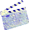
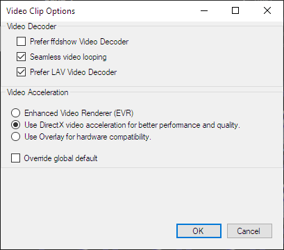
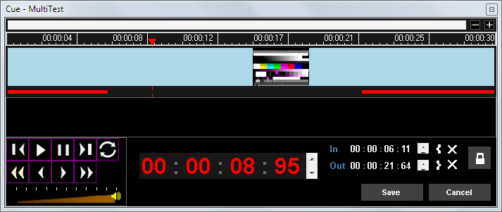
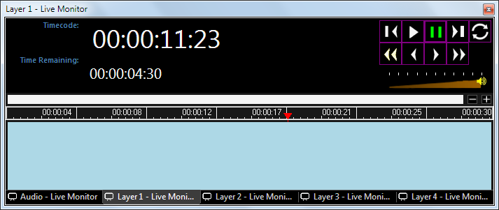

 
# Video Clip

The Video Clip allows you to play a video file stored on the computer.

## Create a Video Clip
There are three ways of creating video clips.

- Click on any empty slot and choose the Video clip. You are presented with a file open dialog from which you may browse the computer and select the video file you wish to use.
-  You may also click and drag video files from Windows Explorer to the Screen Monkey dashboard.
- Click on an empty slot and choose 'Open File...' from the clip browser, using this method allows you to quickly add multiple files.

The supported video container formats are:

*   \*.MPG
*   \*.MPEG
*   \*.MP4
*   \*.WMV
*   \*.AVI
*   \*.FLV
*   \*.MOV
*   \*.MKV
*   \*.M2V
*   \*.M4V

*Note:* To ensure reliable playback and full compatibility the LAV video and audio decoders are required. These are automatically installed with Screen Monkey.

## Configure a Video Clip
No additional configuration is necessary but a number of options are available from the right-click clip menu.

### Mute
Allows you to play the video silently. Click to activate and click again to deactive mute.

### Video Options
If you experience any problems with the smooth playback of video clips then the settings in 'Video Options' may be helpful. These settings may be applied to an individual clip (when 'Override global default' is ticked) or globally to all video clips. The recommended default settings are shown below.

### Edit/Cue
The Edit/Cue dialog provides a timeline view of the clip and allows you to find and set In and Out points. Using In and Out points enables you to play a portion of a media file. There is also a volume adjustment and loop option.

- **Transport Controls** Use the transport controls to find in and out points within the clip.

- **Loop** Click to make the clip play in a loop forever. The button icon is green when loop is active. This setting is saved and will apply every time the clip is played. Equivalent to setting a loop type link on the clip.

- **Volume** The audio level may be reduced using the volume slider

- **Set In/Out** Move the playhead to the desired location and click the { or } buttons to set In and Out points.

- **Clear In/Out** Use the cross buttons to clear the In or Out points.

- **Timecode In/Out** View the timecode of the In and Out points.

- **Padlock** When the padlock is locked the cue points are enabled and will be used in playback. When unlocked the cue points will not be used in playback but they are still saved in the clip settings.

### Transition
Refer to the clip settings [transition page](../clipSettings/transition.md) for details.

### Effects
Refer to the clip settings [effects page](../clipSettings/effects.md) for details.

## Use a Video Clip in a show

- Click the Video Clip to begin playing it
- Click the clip again to pause
- Control-Click to restart the clip from the beginning

## Video Live Monitor
You may wish to open the [Live Monitor](../toolbar/preview.md) in order to use the transport controls and view timecode while the clip is playing.

- The volume fader adjusts the audio level of the playing clip. The adjusted volume is not saved and so will have no effect the next time the clip is played. Use the volume fader in the video clip cue dialog to permanently adjust the volume. 

- The loop button can be used to loop the video forever. The loop button state in the Live Monitor is not saved. Use the loop button in the video clip cue dialog if you need to make the loop setting permanent.

- The timecode displays show the elapsed time as well as the remaining time of the video. 

- The vertical red line will move to show the current position as the clip plays.
