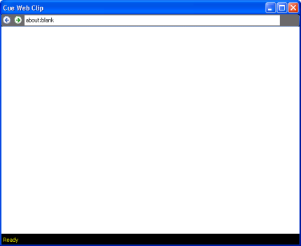
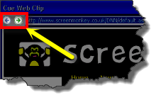

 
# Web Browser Clip

The Web Browser Clip allows you to present any webpage and interact with it.

## How to configure a Web Browser Clip
When you click a slot and choose to add a Web Browser clip, you are presented with a Cue Web Clip dialog.

The dialog contains a field at the top where you may type a web URL such as http://www.screenmonkey.co.uk. After you press Enter, the site should attempt to load and appear in the dialog.

The Cue Web Clip dialog behaves just like a web browser. This means you may click links on the page to navigate to other linked pages. Perhaps you don't wish to always visit the home page of the site and be forced to click links to finally land on the page you really wanted to show. This allows you to browse to the exact page you wish to present when the Web Browser Clip is played.

Notice there are two arrows to the left of the field where you typed the URL. These arrows allow you to move backward and forward just like the backward and forward arrows work in the browser.

Once you find the page you wish to present, click the X in the upper right corner to close the Cue Web Clip dialog. The page is bookmarked and the clip is added to the Main Dashboard. where it then presents a thumbnail of the Web Page.

## How to use a Web Browser Clip during a show
When presenting a show, you click the clip inside Screen Monkey to begin playing it.

You may wish to consider using the [Live Monitor](../../tutorials/WorkingWithShows/LiveMonitor.md) when playing this clip as you may click links in the Live Monitor to interact with the web page the clip points to.
