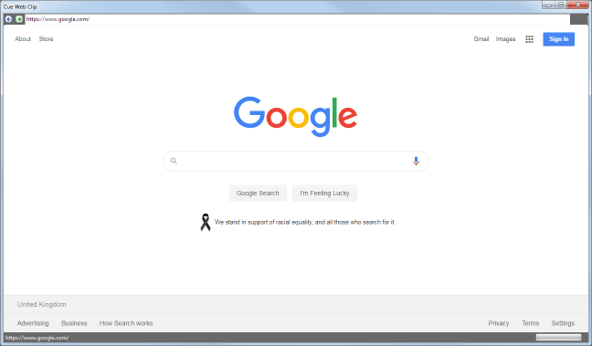
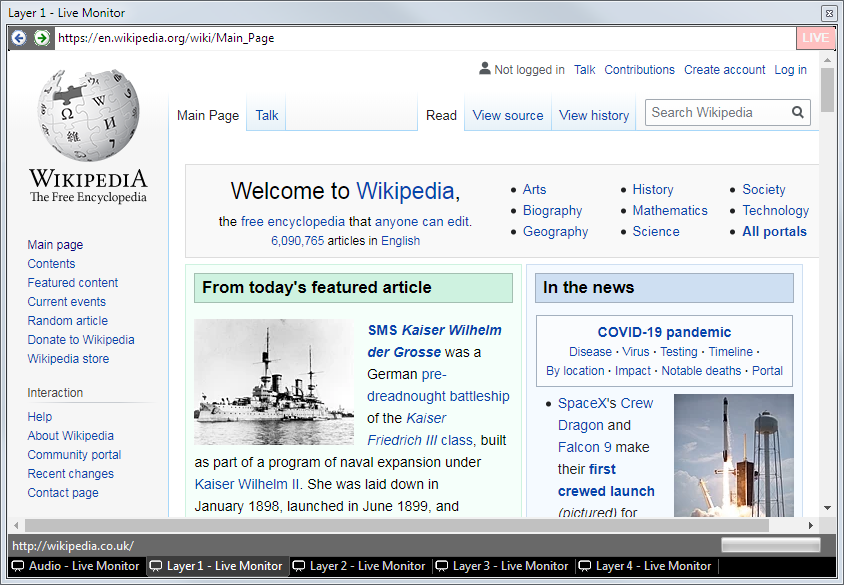

 
# Web Browser Clip

The Web Browser Clip allows you to present any webpage and interact with it.

*Note:* This clip is intended for displaying web pages. There are dedicated clip types for presenting [YouTube](youtube.md) or [Vimeo](vimeo.md) videos.

## Create a Web Browser Clip
Click an empty dashboard slot and choose to add a Web Browser clip. You are presented with a 'Cue Web Clip' dialog. The default site `www.google.com` will open. Type the URL of the site you wish to display in the URL text box at the top of the dialog or search using google.

Once the site you want to present is in the cue preview dialog you can close it by clicking on the red cross in the top right. A new clip will now appear on the dashboard pointing to the site. Left click this clip to play it. The page you last opened will appear on the output.

## Use a Web Browser Clip in a show
When presenting a show, click the clip on the dashboard to begin playing it. The clip will display the page that was saved when the clip was created.

If you need to interact with the website whilst the clip is live, to maybe give a demonstration or tutorial, then you can do this in a couple of ways:

- By right clicking on the clip icon and choosing 'Edit/Cue'
- By using the [live monitor](../toolbar/preview.md)

In either case you now have access to a fully functional web browser inside Screen Monkey. As you click on links and nagivate the website the output will update. There are two arrows to the left of the text field where you typed the URL. These arrows allow you to move backward and forward just like the navigation buttons in any browser.

