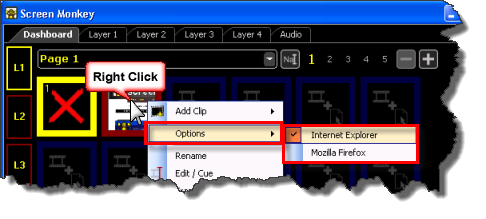

<h1> 
 Web Browser Clip</h1>
<h2>What a Web Browser Clip does</h2>

The Web Browser Clip allows you to present a Web page from the Main 
 Dashboard.

&#160;

<h2>How to configure a Web Browser Clip</h2>

When you click a slot and choose to add a Web Browser clip, you are 
 presented with a Cue Web Clip 
 dialog.

The dialog contains a field at the top where you may type a web URL 
 such as http://www.screenmonkey.co.uk. 
 After you press Enter, the site 
 should attempt to load and appear in the dialog.

The Cue Web Clip dialog behaves 
 just like a web browser. This means you may click links on the page to 
 navigate to other linked pages. Perhaps you don't wish to always visit 
 the home page of the site and be forced to click links to finally land 
 on the page you really wanted to show. This allows you to browse to the 
 exact page you wish to present when the Web Browser Clip is played.

Notice there are two arrows to the left of the field where you typed 
 the URL. These arrows allow you to move backward and forward just like 
 the backward and forward arrows work in the browser.

Once you find the page you wish to present, click the X 
 in the upper right corner to close the Cue Web Clip dialog. The page is 
 bookmarked and the clip is added to the Main Dashboard. where it then 
 presents a thumbnail of the Web Page.

Sometimes you will find that a Web Page has been 
 specifically optimized for working with either Mozilla Firefox or for 
 Microsoft Internet Explorer. When it's important that you use one or the 
 other browsers to view the page Screen Monkey allows you to configure 
 this preference. You configure it by right-clicking the clip and choosing 
 Options.

<h2>How to use a Web Browser Clip during a show</h2>

When presenting a show, you click the clip inside Screen Monkey to begin 
 playing it. 

You may wish to consider using the <a href="../../tutorials/WorkingWithShows/LiveMonitor.md">Live 
 Monitor</a> when playing this clip as you may click links in the Live 
 Monitor to interact with the web page the clip points to.

&#160;

<h2>Enhancement History</h2>

<a href="../../releases/Version_3_7.md#3764BitWebBrowserFix">Version 
 3.7 - March 2012: Web Browser Clip now works on 64 Bit Systems</a>

