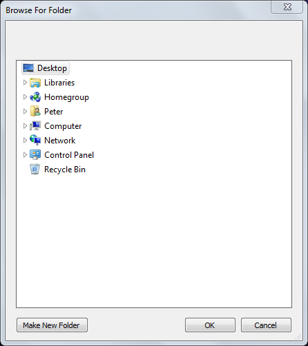
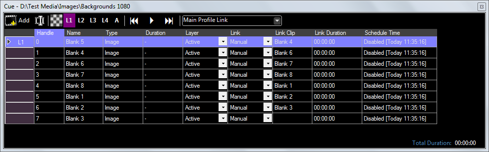
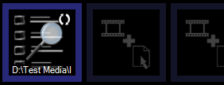

# Folder Search

The Folder Search clip is a special type of cue list which is automatically populated from a folder on your computer. Folder Search is normally used for creating image slideshows however it can also hold video or audio clips.

Although very similar to [Space](CueListSpaceClip.md) and [Playlist](playlist.md) clips the advangtage of Folder Search is that once it is setup it will update without intervention as media is added, replaced or removed from the search folder specified. The linked folder can be on the local computer, part of a sync service, or a network mapped drive. This means the output of Screen Monkey can be easily updated remotely simply by changing the files in the folder.

Screen Monkey will continually update its ouptut to reflect the contents of the linked folder, even when the Folder Search clip is live.

## Creating a Folder Search Clip
Simply create a new Folder Search clip in an empty slot and specify the folder on your computer you wish to use. Screen Monkey will play any compatible media in this folder. Although it is technically possible to mix images, audio and video within a folder search this may make it difficult to template links.

Click OK and the clip will be created. A cue list will open showing the media which has been located.

## Configuration of Folder Search
There are a few configuration changes that will be needed to make Folder Search useful.

1. The media referenced by the Folder Search can be advanced manually by left clicking on the clip but in most circumstances you will want to add links to advance the media automatically. In the case of images this will be a Timer and in the case of audio or video media this will likely be a link At End. Right click on the clip and use the [link template function](../clipSettings/template.md).

2. It's often nice to add a fade transition between slides. This can easily be acheived with the [effects template](../clipSettings/template.md).

3. You may wish to [loop](../clipSettings/playbackSettings.md) the folder search so that it plays forever or until you choose a different clip.

4. The default name of the clip is the filepath, it might be helpful to [rename](../clipSettings/rename.md) it to something more meaningful like 'NoticeSlides'.

5. To play a slideshow with music create a [pair link](../clipSettings/link.md) between the folder search clip and a music cue list.

## Updating Folder Search
As described above the clip will update automatically when the contents of the folder changes. To view media currently referenced in the clip right click and choose 'Edit/Cue'.

*Note:* It is not possible to point an existing Folder Search at a different folder. If you need to change the search folder path you will need to create a new clip.

## Using a Folder Search Clip
Click to play the clip as normal. The folder search clip may be assinged to a layer or linked to other clips as required. The 'move next' link is on by default for media inside folder search so left clicking on the Folder Search will manually advance to the next clip.

