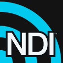
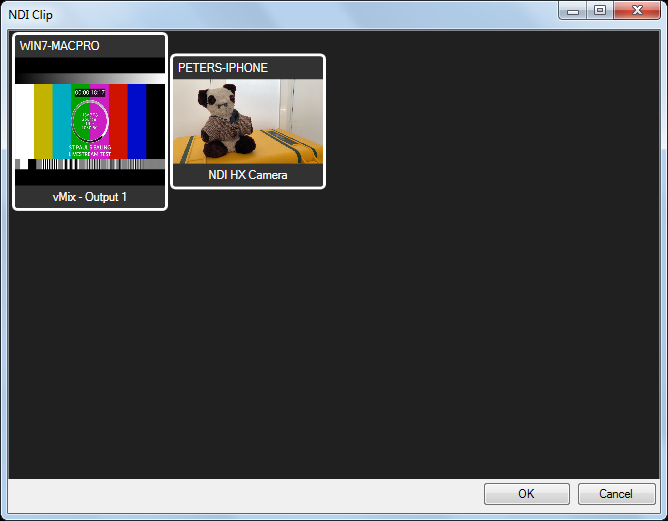

# NDI Clip

[Network Device Interface (NDI)](https://www.ndi.tv) is a standard for sending high quality low latency live video and audio over a local ethernet network. There are a wide range of hardware and software devices capable of transmitting and receiving NDI streams including cameras, vision mixers, and display devices. Using a simple app you can even turn your phone into an NDI camera. One of the benefits of NDI is that it is extremely easy to setup and use.

Screen Monkey can receive NDI streams but it cannot generate them. 

To use an NDI stream in Screen Monkey create a new NDI clip. You will then see a preview window with all of the streams detected on the local network. Select the stream you wish to use and click ‘ok’. You may add additional streams by creating more NDI clips.

If the stream you want is not shown check your network settings and check the sending device is switched on and operating. 
