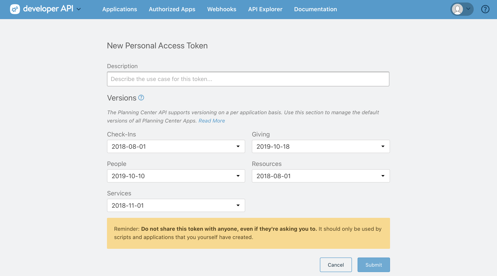
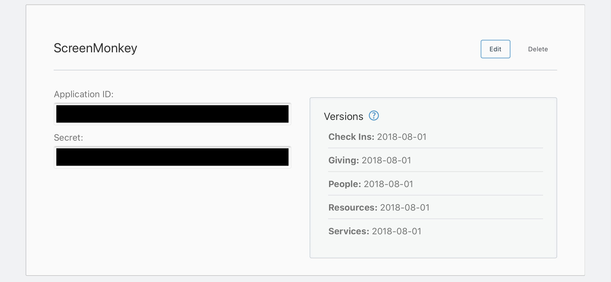
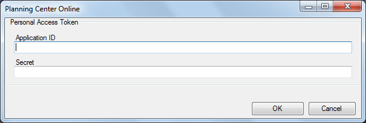
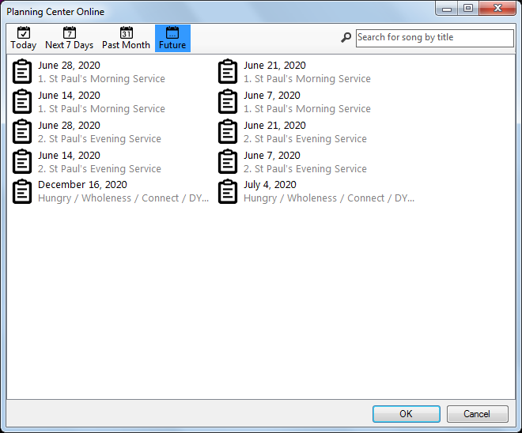
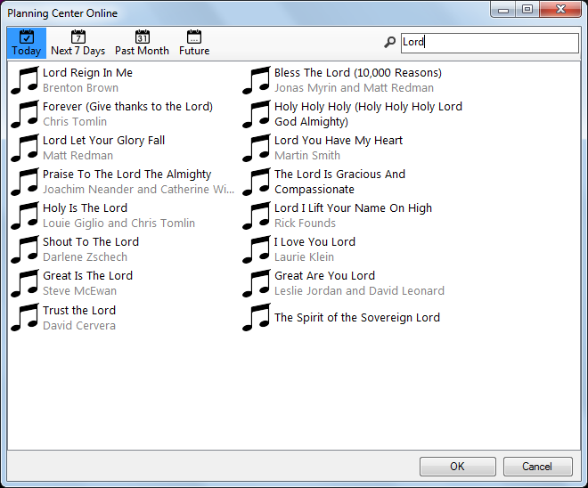

# Planning Center Clip

[Planning Center](https://www.planningcenter.com/services/) is a popular management system for churches. With a Planning Center Services subscription you can create service plans (lists of worship songs) and import them directly into Screen Monkey. This means the words operator using Screen Monkey will have a complete and accurate set of songs as picked by the worship leader.

The Screen Monkey Planning Center clip simply creates a set of [Song](Song/SongClip.md) clips using the lyrics and metadata prodivded by Planning Center. When using the Planning Center clip there is no requirement to maintain a database of song lyrics on the Screen Monkey computer. Every time a song is used it is downloaded from the Planning Center online database.

## Prerequisites

- The Screen Monkey computer must be connected to the internet
- Your own [Planning Center Services](https://www.planningcenter.com/services/) account
- A [Personal Access Token](https://api.planningcenteronline.com/oauth/applications) application ID and secret key for your account
- A set of songs in your Planning Center Services database
- Optionally, a service plan created in your Planning Center Services account (recommended).

## Getting Started
First visit the [API setup page](https://api.planningcenteronline.com/oauth/applications) on the Planning Center online website, login, and create your Personal Access Token. Enter any description you choose and press 'Submit'.

Your tokens will then be provided by Planning Center. They will be long strings of letters and numbers. In the example below they have been redacted.

Now you have your tokens you can setup Screen Monkey for use with Planning Center. Start by creating a new Planning Center clip. The first time the clip is used you need to enter the tokens you created in the previous step. This step is only required once. The simplest method is to copy and paste the tokens from your web browser into Screen Monkey.

After entering the tokens click OK and the Planning Center dialog will appear. Here you will be able to view service plans and search for songs.

## Using a Service Plan
Click on an empty slot on the Screen Monkey dashboard and create a new Planning Center clip. This slot will hold the first song in the plan and subsequent songs will fill the following slots. It's recommended to use a couple of empty dashboard rows to hold the songs and start in the first column.

The Planning Center dialog will appear and after a short wait it will show your plans. You can filter the view based on date by using the toolbar buttons.

Double click the service plan you wish to use. All songs referenced in that plan will be imported and added to the dashboard in order.

## Selecting a single song
If you do not have a service plan or only require a couple of songs for your service then it's possible to import them directly into Screen Monkey without using a plan.

Create a Planning Center clip as normal but instead of selecting a plan enter the title, or partial title, of a song in your Planning Center database in the seach box. Press enter or click the magnifying glass to see matching songs. Then double-click on a song musical notes icon to select it and add it to the dashboard.

## Notes

- Planning Center songs can include chords. These will be imported by Screen Monkey and are visible in the song clip editor but by default they will not be displayed on screen. This behaviour can be changed in the [Song Display](Song/SongDisplay.md) settings.

- Take care to match your Screen Monkey [song tags](Song/SongTags.md) to those in your Planning Center library so that Screen Monkey can identify the song sections.

- You may optionally use Planning Center song sequences however this is not recommended because Planning Center sequence codes do not map 1-1 with Screen Monkey and this can lead to confusion and missing sections.

- Your Personal Access Token is saved by Screen Monkey and will not be lost if you create a new show. 

