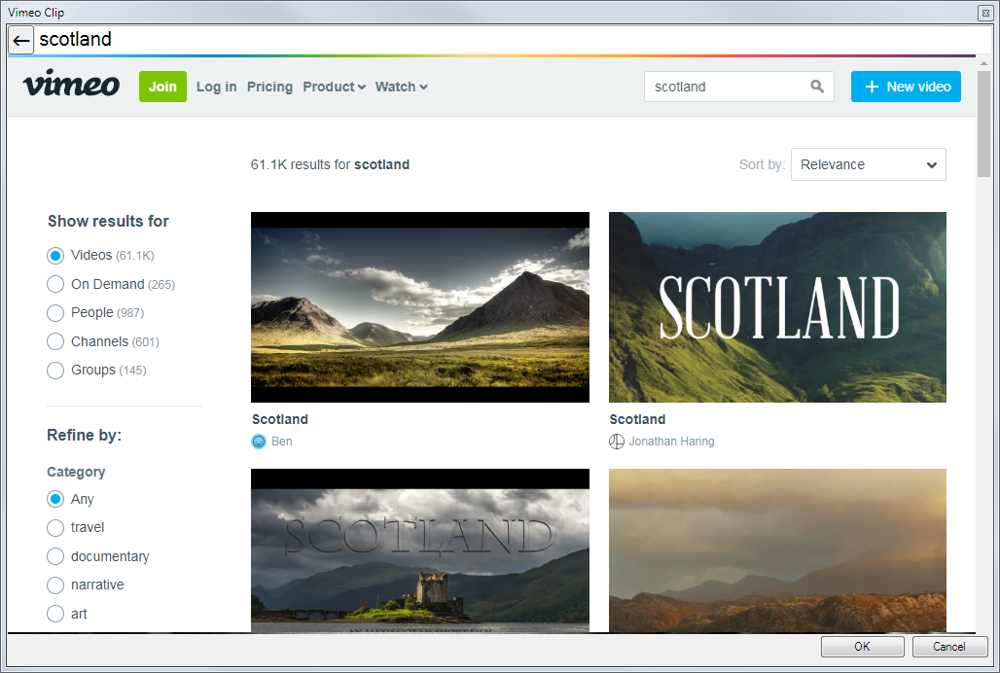
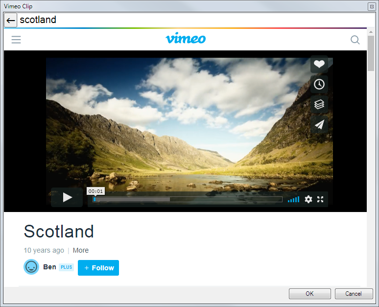

# Vimeo Clip

The Vimeo clip allows you to easily display any video hosted on the [Vimeo](https://vimeo.com) platform.

## Create a Vimeo Clip
Click on any empty dashboard slot and choose Vimeo from the new clip browser. A dialog containing a web browser will open and show the Vimeo homepage. Using this window search for the video you want to present.

Once you have located the video navigate to the watch page for the video and then click OK. 

A new clip will appear on the dashboard with the thumbnail from the video.

You can add links, effects and transitions like any other clip. 

*Note:* There is no Edit/Cue function for Vimeo clips, if you need to show a different video you must create a new clip.

## Use a Vimeo Clip in a show
Once the clip has been created it will behave like a video file clip. Left click the clip to start playing, click again to pause. 

*Note:* There is no live monitor available for Vimeo clips. 
