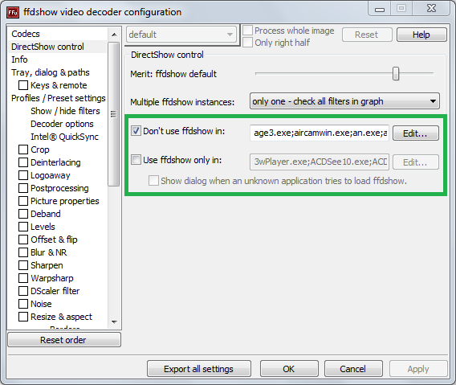

# FAQ

Answers to some common issues and questions.

## No output
- Check secondary display is connected and powered on and that you can see the Windows desktop on it
- Check [display scaling](../start/gettingStarted.md) is set to 100% in Windows display settings
- Check Screen Monkey [display profile](toolbar/display.md)

<!--
## Video does not play or Live Monitor timecode does not update
- Check ffdshow (from [K-Lite Mega](https://codecguide.com/download_kl.htm) package) is correctly installed and ‘Use ffdshow only in:’ is not ticked in ffdshow settings.

-->

## PowerPoint playback
- To use PowerPoint clips in Screen Monkey you must have a licensed copy of Microsoft PowerPoint installed. Check that you have a compatible version installed on your computer. PowerPoint version 2013 or later is required.