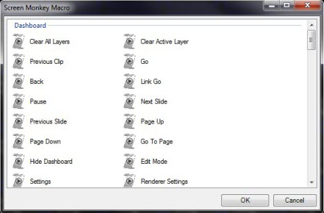

<h1> Interaction Macro</h1>

The Interaction Macro allows you to add Screen Monkey controls to the 
 clip slots. 

This could be handy if you wanted a big Go button or you want more direct 
 access to some hidden controls. You add a macro by clicking on an empty 
 slot and selecting &quot;Choose Macro...&quot; you then double click on 
 the Interactions macro.

You will now see a full list of actions within Screen Monkey from which 
 you can select the action you want.

The macro will then be added to the clip 
 slot and your chosen action will be performed every time you run the macro. 
 Where interaction macros become really powerful is that they can be scheduled 
 or linked to other clips.

