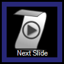

Interaction
===========

The Interaction Macro allows you to add internal Screen Monkey controls to dashboard clip slots.

This could be handy if you wanted a big Go button or you want more direct access to some hidden controls. You add a macro by clicking on an empty slot and selecting 'Choose Macro...' you then double click on the Interactions macro.

You will now see a full list of actions within Screen Monkey from which  you can select the action you want.

The macro will then be added to the clip slot and your chosen action will be performed every time you run the macro. Where interaction macros become really powerful is that they can be scheduled or linked to other clips.

