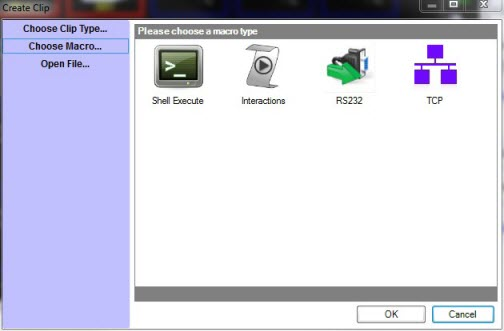
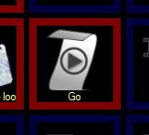

<h1>Macros</h1>

You may simply create a macro to shut down your computer or use an <a 
	 href="RS232Macro.md">RS232 macro</a> to turn on a projector. Whatever 
 you want to do macros give you the potential to control other devices 
 from within Screen Monkey. A macro behaves as any clip and so can be linked 
 to and run in the same manner as a normal clip. 

To add a macro, click on an empty clip slot to bring up the Create 
 Clip dialog. Now click &quot;Choose Macro&quot; to display the 
 list of macros available.

Select the macro you want to create and a custom dialog for that macro 
 type will appear allowing you to create the macro.

Once you have created the macro you can play and link to it just as 
 any normal clip. The only difference is that it will not take control 
 of the layer and will stop once the macro has completed.

