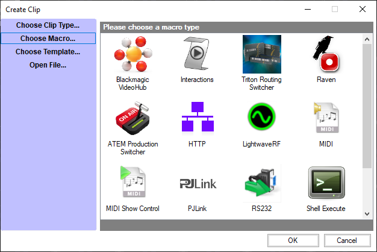

# Macros

**Macros require a Screen Monkey Pro licence.**

Macros can be used to extend Screen Monkey to control a wide range of external devices and software. You may simply create a macro to shut down your computer or use a [PJLink](pjlink.md) marco to turn on a projector on your network. Whatever you want to do macros give you the potential to control other devices from within Screen Monkey. A macro behaves as any clip and so can be renamed, linked, scheduled and run in the same manner as a normal clip.

To add a macro, click on an empty clip slot to bring up the Create Clip dialog. Now click ‘Choose Macro...’ to display the grid of macros available.

Select the macro you want to create and a custom dialog for that macro type will appear allowing you to configure the macro. See the help pages for each macro type for more details.

Once you have created the macro you can rename, play, link and schedule it just as any normal clip. The only difference is that it will not take control of the layer and will stop once the macro has completed. Most macros will have a purple outline while they are active.