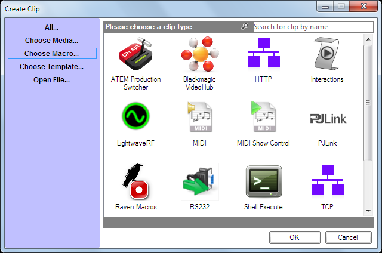

# Macros

**Macros require a Screen Monkey Pro licence.**

Macros can be used to extend Screen Monkey to control a wide range of external devices and software. You may simply create a [Shell](ShellMacro.md) macro to shutdown your computer or use a [PJLink](pjlink.md) marco to turn on a projector on your network. Whatever you want to do macros give you the potential to control other devices from within Screen Monkey. 

A macro behaves like any other clip and can be renamed, linked, scheduled and run in the same manner as a standard clip. The only difference is that it will not take control of the layer and will stop once the macro has completed. Most macros will have a purple outline while they are active.

## Creating Macro Clips
To add a macro, click on an empty clip slot to bring up the Create Clip dialog. Now click ‘Choose Macro...’ to display the grid of macros available.

Select the macro you want to create and a custom dialog for that macro type will appear allowing you to configure the macro. For many macro types a device must be added first, then the command selected as a second step.

The procedure for most equipment control macros is as follows.

1. Click an empty dashboard slot
2. Click 'Choose Macro...' or use the clip search box
3. Click on the macro type you wish to add and click ok
4. In the dialog which appears click 'New'
5. Enter a name to identify the device (eg 'Camera1')
6. Enter an IP address and any additional parameters required (eg username and password)
6. Click OK
7. If the command list does not populate with options click 'Cancel'
8. Repeat steps 1 to 3
9. Click on the command you wish to execute
10. Click ok and the new macro clip will appear on the dashboard

See the help pages for each macro type for more details.

