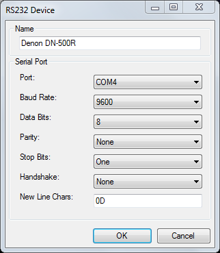
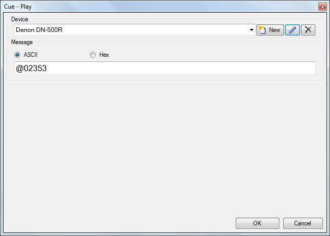
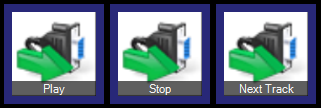

# RS232

Screen Monkey can control external equipment using a serial RS232 interface. Many professional presentation and AV devices such as projectors, display screens, media players, etc can be controlled in this way. Before using this macro you will need a Com (Serial) port on the computer running Screen Monkey and a data cable to connect your computer to the device to be controlled.

The first time you add a RS232 macro for a piece of equipment you need to enter the communication settings. Click on the ‘New’ button to create a new device profile. Please refer to the documentation of the device for details on what these settings should be, the examples below are for a Denon audio recorder. You must also enter a friendly name to identify the device. Click OK to save the device parameters.

   
You will now need to enter a control message to send to the device so that it will perform a specific action such as ‘Play’ or ‘Stop’. You have the option to enter commands in either ASCII or Hex format. Please refer to the device's documentation for a list of commands you can send to the device.

When you are finished click OK and the macro will be added to the clip slot. Whenever you click the macro the RS232 message will be sent to the device. These clips can also have links and schedules allowing complex automation. You can continue creating as many command clips as you need with the same device profile and different control messages.

