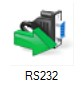
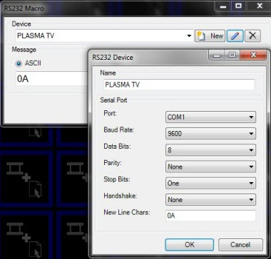
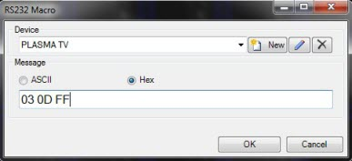
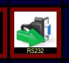

# RS232

You add a macro by clicking on an empty slot and selecting &quot;Choose 
 Macro...&quot; you then double click on the RS232 macro.

You now need to create a new device which specifies the settings for 
 talking to the RS232 compatible device. Please refer to the documentation 
 of the device for details on what these settings should be.

Once you have entered a name to identify the device, click OK.

You will now need to enter a message to send to the device that will 
 perform a specific action such as turn on. You have the option to enter 
 commands in either ASCII or Hex format. Please refer to the device's documentation 
 for a list of commands you can send to a specific device.

When you are finished click OK 
 and the macro will be added to the clip slot. Whenever you click the macro 
 the specific RS232 message will be sent to the device.

