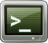
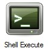

<h1> Shell Macro</h1>

The shell macro allows you to run windows shell commands from within 
 Screen Monkey. 

When you click on the macro the command line script will be run.

To create a shell macro, select the Shell 
 Execute macro when adding a new clip. This will open the command 
 editor where you can type standard windows commands. Each line will be 
 executed as a separate command allowing you to write scripts with multiple 
 commands.

