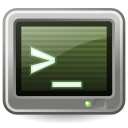
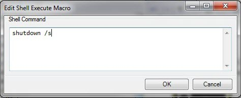

# Shell Execute

The shell macro allows you to run Windows shell commands from within Screen Monkey.

When you click on the macro the command line script will be run.

To create a shell macro, select ‘Shell Execute’ when adding a new macro clip. This will open the command editor where you can type standard Windows commands. Each line will be executed as a separate command allowing you to write scripts with multiple commands.
 
