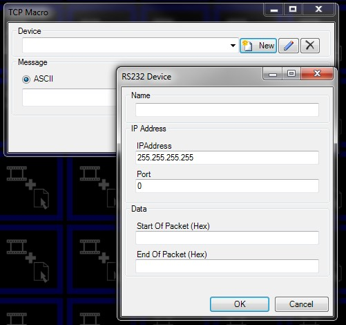
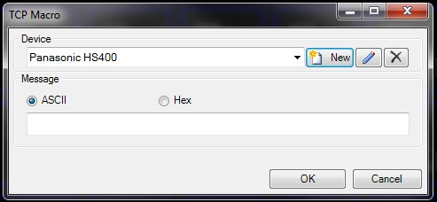
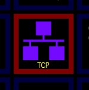

# TCP

The TCP macro allows you to communicate with devices using Transmission Control Protocol (TCP).
 
You now need to create a new device which identifies what you want to talk to on the network.

Enter the correct IP Address of the device you want to talk to on the network. If you do not know the IP address, please refer to the documentation for that device to obtain the correct address. You also need to enter the correct 
 Port which 
 will also be found within the device settings of the device you want to 
 talk to. Once you have entered a name to identify the device click OK.

You will now need to enter the message you 
 wish to send to the device. You can either enter it as an ASCII string 
 or a Hexadecimal string. Details of the messages you need to send will 
 be found in the documentation of the device you wish to talk to.

When you are finished the macro will be added 
 to the clip panels and the message you selected will be sent every time 
 you run the macro.

