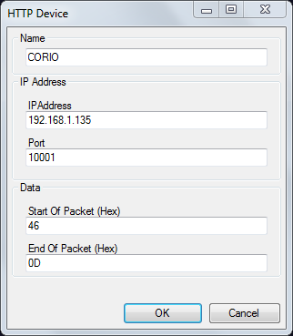
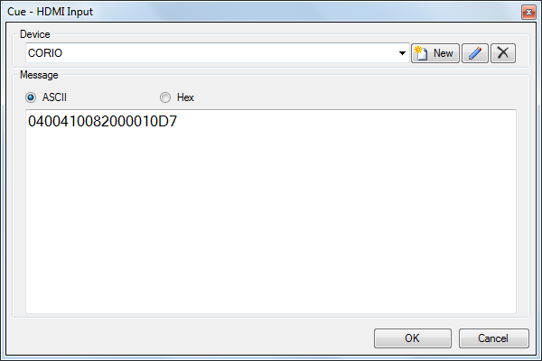
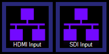

# TCP

The TCP macro allows you to communicate with devices and send commands using Transmission Control Protocol (TCP).
 
The device you wish to control must have an IP address and be configured so that Screen Monkey can connect to it on your network.

Before you can control a device you must add it to Screen Monkey. Create a new TCP macro clip and then click the ‘New’ button in the device section.

Enter the IP address of the device you want to talk to and also enter the TCP Port. Optionally you can enter start of and end of packet bytes. This information will be found within the documentation for the device you want to control. Also enter a name to identify the device and click OK.

The example below is for a TVOne Corio universal scaler.

After creating the device settings you will need to enter the message you wish to send to the device. You can either enter it as an ASCII string or a Hexadecimal byte string. Details of the messages you need to send will be found in the documentation of the device you wish to talk to. 

In this example the command will switch the primary input of the scaler to HDMI.

When you are finished the macro will be added to the dashboard clip and the message you entered will be sent every time you run the macro.

Each command you wish to send will require a new clip. You can add as many macro clips as you need for a device.