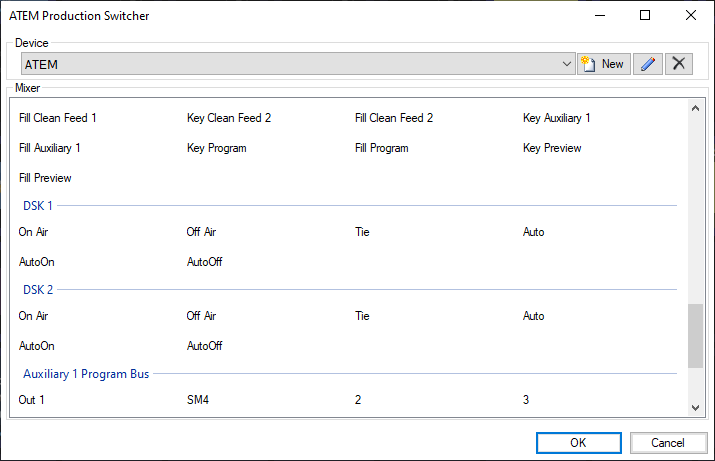
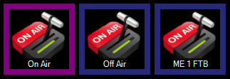

# ATEM Production Switcher

[Blackmagic ATEM switchers](https://www.blackmagicdesign.com/products) can be fully controlled by Screen Monkey. This is a powerful way of integrating media playout and broadcast hardware processing. 

## Install 
The ATEM macro functionality is an optional install which must be selected in the Screen Monkey installation wizard. If you did not originally install the option it can be added later, just re-run the installer and choose ‘Change’.

## Prerequisites 
The Blackmagic ATEM software must be used to set the IP address of your ATEM if it is not configured from the front panel of the device. The IP address of the ATEM and the network must be configured to allow the computer running Screen Monkey to connect to the ATEM. This can be checked with a simple `ping <ip address of ATEM>` command from Windows command prompt. If the ping fails you will not be able to control the ATEM from Screen Monkey and you should check your network settings.

## Initial setup
The first time you add an ATEM macro clip you will need to create an ATEM device. To do this:

- Create a new ATEM clip
- Click ‘New’ in the device section of the ATEM clip dialog
-  A new device settings dialog will appear
- Enter a name and the IP address of the ATEM you want to control. The name is used in Screen Monkey for identifying multiple ATEM devices and can be anything you choose.

## ATEM macros
After successfully creating an ATEM device Screen Monkey will show you all the commands available. This list will vary depending on the model of ATEM you are using and can be a very long list. For a detailed explanation of these commands refer to the Blackmagic documentation.

Select a command you wish to assign to a macro. For example Fade to Black (FTB) and then click OK. It will appear as a new clip on the dashboard.

## ATEM clips
ATEM macro clips appear on the dashboard and can be renamed, linked and scheduled as any other clip type. If a function is active on the ATEM then the clip will be highlighted purple. Any change made on the ATEM software or hardware, eg pressing FTB, will be reflected in Screen Monkey immediately.

