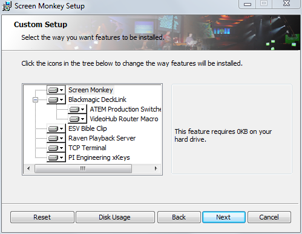
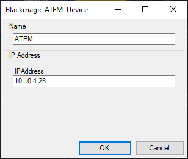

# Blackmagic ATEM Production Switcher

[Blackmagic ATEM switchers](https://www.blackmagicdesign.com/products) can be fully controlled by Screen Monkey. This is a powerful way of integrating media playout and broadcast hardware processing. 

## Install 
ATEM functionality is an optional install which much be configured in the Screen Monkey installation wizard. If you did not originally install the option it can be added later, just re-run the installer and choose ‘Change’.

## Prerequisites 
The Blackmagic ATEM software must be used to set the IP address of your ATEM if it is not configured from the front panel of the device. The IP address of the ATEM and the network must be configured to allow the computer running Screen Monkey to connect to the ATEM. This can be checked with a simple `ping <ip address of ATEM>` command from Window command prompt. If the ping fails you will not be able to control the ATEM from Screen Monkey.

## Initial setup
The first time you add an ATEM macro clip you will be asked to specify a name and the IP address of the ATEM you want to control. The name is used for identifying multiple ATEM devices and can be anything you choose, for example `TV ATEM1`. 

## ATEM macros

