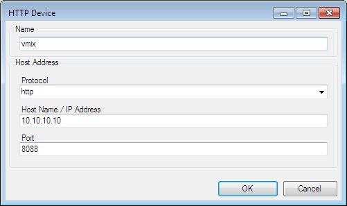
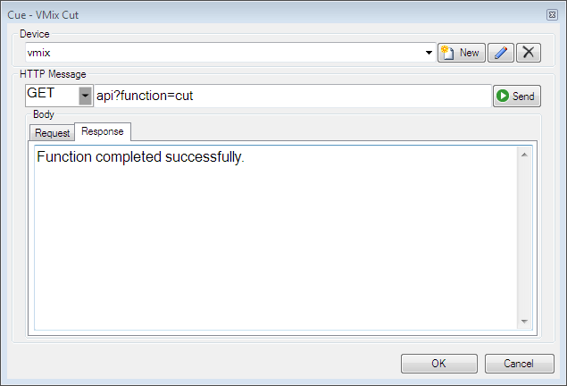
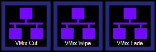

# HTTP
The HTTP macro allows you to create HTTP/HTTPS GET and POST messages. This is useful for controlling other external devices or applications either locally or over a network.

The exact message structure that you need to send to the target device to perform an action will be specified in the user guide or help documentation of the device to be controlled. Look for an API or Remote Control section.

## Devices
Screen Monkey requires you to create a device profile for each target to be controlled. To do this first create a new HTTP Macro clip then click the 'New' Button in the device section of the dialog. The following device settings dialog will open with default settings.

Enter the following information. All fields are required.

- **Name** A memorable label for the device, this can be anything you like

- **Protocol** Choose to use regular HTTP or secure socket HTTP

- **Host Name/ IP Address** The target device must have either an IP address or hostname which is routable from the computer running Screen Monkey. 

- **Port** The TCP/IP port on the target device which accepts the control messages.

## Message
Now click OK to save the new device. You are now ready to send a message.

Choose GET or POST as the message type. If you are unsure use GET as this is more common for API interfaces.

The text of the message will be specified in the user guide of the application you are controlling. In this example we are telling the VMix software vision mixer application to perform a CUT from Preview to Program.

It is a good idea to test the settings at this point. Click the 'Send' button to check you get the expected response at the target device. Any messages returned will be displayed in the lower half of the dialog. Here the test was successful and returned 'Function completed successfully.'

Now you can click OK to create the clip on the dashboard. Each time you click this clip to run it the message will be sent and the action performed. 

## Creating Clips
You can create multiple clips for the same device and you can create multiple devices. It will be necessary to [rename](../clipSettings/rename.md) the clips so you can easily identify what they do.

Clips can be [linked](../clipSettings/link.md) to each other or to any other clip type. You can also build in automation by [scheduling](../toolbar/schedule.md) these macros.

