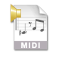

# MIDI

The [MIDI](https://en.wikipedia.org/wiki/MIDI) macro allows you to communicate with external devices using MIDI commands. Your computer will need either a MIDI expansion card or a MIDI USB interface.

