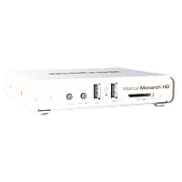
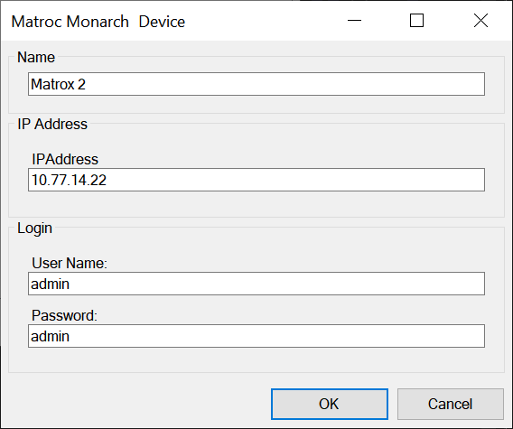
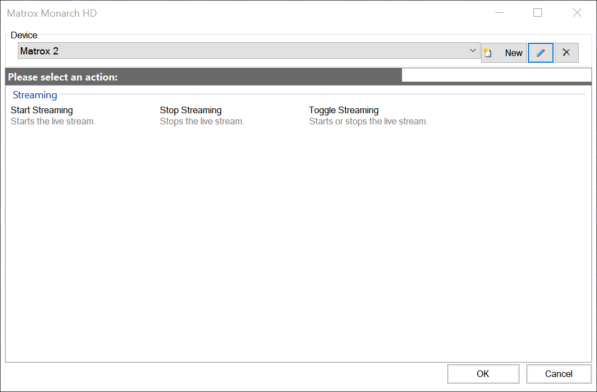

# Matrox Monarch HD

Matrox Monarch HD is a small, easy-to-use video streaming and recording appliance designed for professional video producers to stream a live event while simultaneously recording a higher, master quality version for post-event editing or archiving.

Available Monarch HD clips:

* Start Streaming
* Stop Streaming
* Toggle Streaming

To add a Monarch HD for control, create a new Monarch HD clip then click the 'new' button. A dialog will open - enter a name to identify the device, IP address, username and password.

After saving the device settings you will be able to create macro clips from the actions shown in the device dialog.

