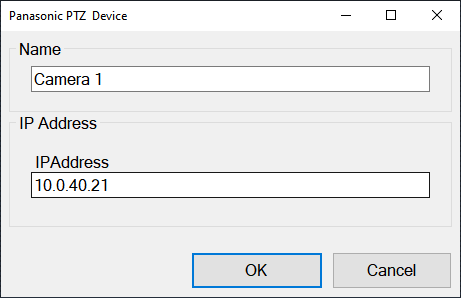
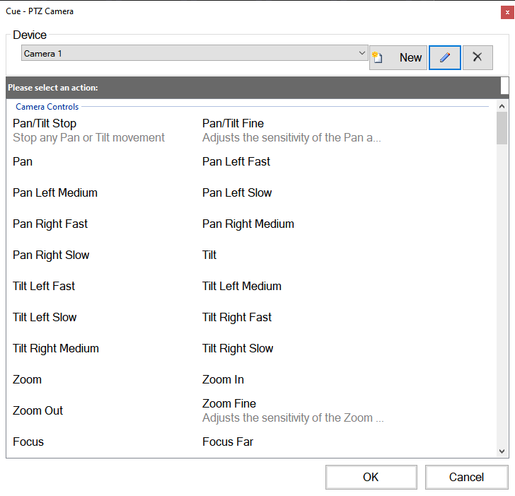

# Panasonic PTZ Camera
The Panasonic PTZ macro allows you to control a Panasonic AW series PTZ camera. The camera must be accessible on the network. To test this you can use a web browser to open the IP address of the camerea on the Screen Monkey computer. Assuming this works add each camera as a new device.

First create a Panasonic PTZ macro clip and then click the new button. Enter the information required based on your setup. If you have multiple cameras then they must be on different IP addresses and added as separate devices.

After saving the new PTZ device you will be able to create macro clips for any command supported by the device, for example recalling a preset, zooming, adjusting iris etc. 

