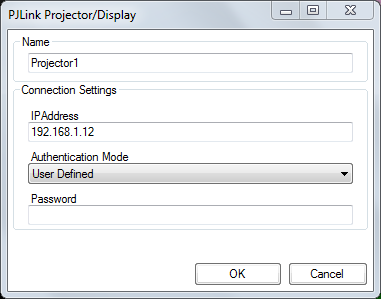
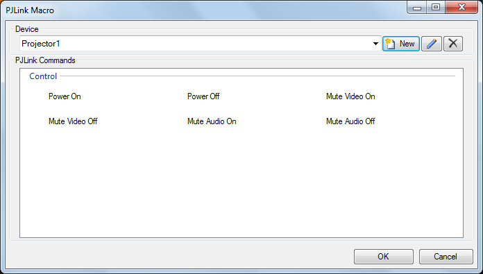

# PJLink

[PJLink](https://pjlink.jbmia.or.jp/english/) is a protocol for controlling projectors over ethernet. It is supported by a number of manufacturers including Panasonic and Hitachi. Not all projectors have an ethernet port or PJLink support, check the specification or manual for your projector before attempting to control it.

## Prerequisites 
A network connection is required between the computer running Screen Monkey and the projectors to be controlled. You must set a valid IP address on each projector. Check the user guide for your device for details on how to do this.

## Add device
The first step is to add the projector to Screen Monkey. You will need to specify a name, IP address of the projector and optionally authentication details. Some projectors require a password, others do not. Check your user guide.

## Macros
Once communication is established Screen Monkey will be able to display the commands supported by the projector. 

These usually include power on, power off, input selection, mute, etc. Select the command from the grid and click ok. That command will be mapped to a new clip on the dashboard and can be played, renamed, scheduled and linked. The command clips will highlight purple to show that they are active. For example if the projector is powered on then a ‘power on’ clip will be purple. Similarly if you add a clip for each projector input (SDI, VGA, Video, etc) then the currently active input will be highlighted. This is even true if the input is switched using the projector remote control or input buttons.

## Notes
A projector will take some time to power down due to the need to cool the lamp. This means there maybe a delay between clicking a power off clip and it highlighting purple.

