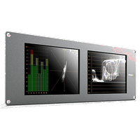
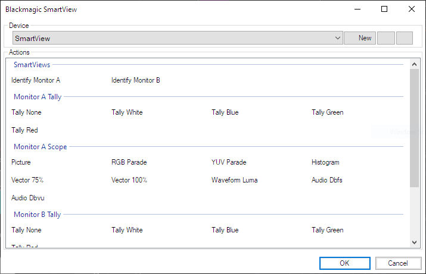

# Blackmagic SmartView

The SmartView macro allows you to control the [Blackmagic SmartView and SmartScope](https://www.blackmagicdesign.com/products/smartview) SDI video monitors.

## Prerequisites 
The Blackmagic SmartView software must be used to set the IP address of your monitors. The IP address of the SmartView and the network must be configured to allow the computer running Screen Monkey to connect to the SmartView. This can be checked with a simple `ping <ip address of SmartView>` command from Windows command prompt. If the ping fails you will not be able to control the SmartView from Screen Monkey and you should check your network settings.

## Creating the device
Before you use the Smartview macro you must create a device. To do this:

- Create a new SmartView macro clip
- Click ‘New’ on the toolbar of the SmartView clip dialog
- A new device settings dialog will appear
- Enter a name and the IP address of the SmartView you want to control. The name is used in Screen Monkey for identifying multiple SmartView devices and can be anything you wish.

## Creating macro clips
Once you have a device configured and connected you will be able to create clips coresponding to the actions shown in the table. Simply pick an action you wish to perform and add it as a new clip. You can create multiple clips for each SmartView.

