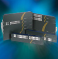
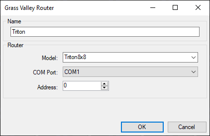
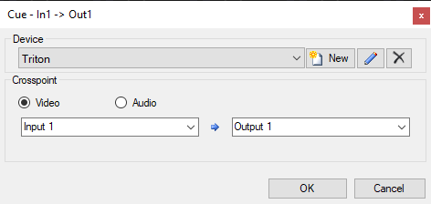
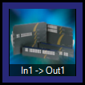

# Triton Routing Switcher

The Triton/Network VikinX/GrassValley RS232 control protocol enables the remote control of video and audio routing switchers (also known as matrices). The protocol allows for both setting and getting crosspoints so Screen Monkey will always show the current state of the routes, regardless of how the routes are made.

## Prerequisites
The router to be controlled must be connected to a RS232 serial (com) port on the computer running Screen Monkey. For the pinout of this cable refer to your router user guide.

To add a new router specify a name, model (router frame size) and com port. If the exact size of router you require is not listed pick one larger and only create clips for the sources and destinations which exist. The address should be left set to zero.

## Define routes
For each route you want to make (source > destination) a new clip is required. These are all created in the same way, simply choose the appropriate source and destination from the input and output dropdown lists before creating the clip. The clip name is set automatically.

### Labels
It’s usually a good idea to rename the Triton control clips to have more meaningful names. For example instead of `In1 -> Out1` you could use `Cam1 Preview`.

## Revertives
The crosspoint status of the router is communicated to Screen Monkey. Any route which is active will be highlighted in purple. These will update if routes are changed on the hardware buttons or in another control system.
