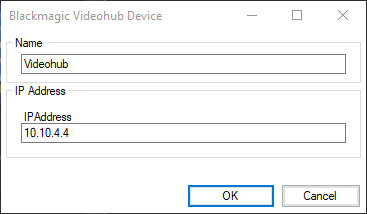
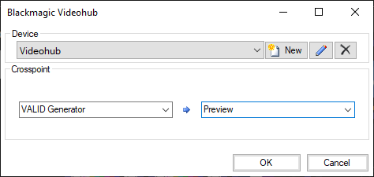
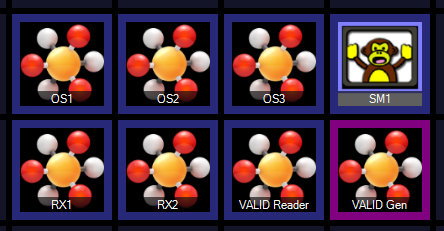

# Blackmagic Videohub
The [Blackmagic Videohub](https://www.blackmagicdesign.com/products) range of video routers can be controlled by Screen Monkey using macros. A Videohub macro clip sends a single crosspoint to the router (one source to one destination). Multiple Videohub macro clips are therefore normally required to build useful functionality.

## Prerequisites
The computer running Screen Monkey needs to be able to access the router(s) through a network connection. You will need to set an appropriate IP address on the router. 

The Blackmagic Videohub software is required to be installed on the computer. This is a free download from Blackmagic Support website.

Screen Money will display the source and destination names set in the Blackmagic software but it cannot change them, therefore you should use the Blackmagic software to name the sources and destinations if required.

## Creating a new Videohub device

## Creating a new Videohub clip

Videohub clips are added to the dashboard with automatically generated names. These can be changed to anything you like using [clip rename](../clipSettings/rename.md). It is also possible to change the thumbnail image as seen below. 

To change a crosspoint simply left click on the macro clip. The purple outline will always highlight active crosspoints regardless of where those crosspoints are changed. If a crosspoint is changed on a BlackMagic hardware panel then Screen Monkey will immediately update to show this. Videohub clips may have [links](../clipSettings/link.md) to or from other clips and be [scheduled](../toolbar/schedule.md) to execute at a predetermined time which allows for powerful automation systems to be built. 

