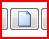

# Display

Display profiles allow you to quickly and easily choose display style 
 for the main screen that suits you. You can either choose from one of 
 the pre-defined profiles or create your own. Each profile defines the 
 size, position and monitor that each layer is presented on.

The display profiles can be found in the settings menu.

To change the current display profile simply choose the desired profile 
 from the drop down list.

If you want to create your own profile you can do this in the profiles 
 editor. Just click on the new profile button  and 
 enter a name for the profile. The profiles editor will then open. You 
 can use the profiles editor to adjust the size and position for all three 
 layers.

Either change the settings from the properties list on the left hand 
 side or use the mouse to drag and resize the layers on the screen view. 
 As you select each layer the properties will update to show the selected 
 layer.

<h2>Layer Settings</h2>

Each of the layers has the following settings you may configure.

<ol class="hcp3">
	<li value="1">Border Colour - If the border style is set to solid this 
	 is the colour of the border placed around the layer.</li>
	<li value="2">Border Style - Set to solid to place a border around 
	 the layer and none to have no border.</li>
	<li value="3">Border Width - The width of the border placed around 
	 the layer.</li>
</ol>
<ol class="hcp3">
	<li value="1">Shape - you can choose from either rectangular, circular 
	 or polygon. Each changes the shape of the layer. When set to polygon 
	 you can use the edit view to create any shape you wish.</li>
</ol>
<ol class="hcp3">
	<li value="1">AspectRatio - determines how content which does not fit 
	 the layer dimensions is resized to fit. When set to maintain the media 
	 will be resized but the aspect ratio will be maintained and you may 
	 get black borders at the sides or along the top. When set to stretch 
	 the media will be stretched to fit the layer.</li>
	<li value="2">Hidden - whether the layer is displayed or not. This 
	 could be useful for example it you are displaying audio files and 
	 want to overlay this with your own slideshow, and set all the audio 
	 on layer 1, with your slide show on layer 2 or 3.</li>
</ol>
<ol class="hcp3">
	<li value="2">Height - the height of the layer as a percentage of the 
	 whole screen. A height of 50% will mean the layer height is half the 
	 height of the screen.</li>
	<li value="3">Width - the width of the layer as a percentage of the 
	 whole screen. A width of 50% will mean the layer width is half the 
	 width of the screen.</li>
	<li value="4">OffsetX - the horizontal offset from the center of the 
	 screen as a percentage of the screen width. A negative offset will 
	 result in the layer shifting to the left on the screen and a positive 
	 offset will result in the layer shifting to the right.</li>
	<li value="5">OffsetY - the vertical offset from the center of the 
	 screen as a percentage of the screen height. A negative offset will 
	 result in the layer shifting to the top of the screen and a positive 
	 offset will result in the layer shifting to the bottom of the screen.</li>
	<li value="6">Zoom - proportionally scales both the width and the height 
	 as a percentage of the screen dimensions.</li>
	<li value="7">Monitor - the computer monitor to display the layer on.</li>
</ol>
<h2>Editing a Layer's Shape</h2>

The easiest way to edit a layer's shape is in the editors preview. The 
 default shape for a layer is rectangular and you can click on a layer 
 to adjust the size and position of the layer within the screen.

There are two other shapes for a layer which you can select from to 
 give you the type of clipping you require. With the polygon shape you 
 can define almost any shape you wish and this gives you a lot of flexibility.

You will notice that when you select a layer by clicking on it, some 
 tool buttons will appear in the top left of the editor. You can use these 
 to select the shape you wish.

Once you have selected your desired shape, use the mouse to adjust it. 
 You may want to turn the visibility of a layer on or off to make it easier 
 to see the layer you are editing. To make a layer invisible, you click 
 on the eye icon in the layers list.

When in polygon mode you can create a new point 
 just by clicking on the line where you want the point to appear and existing 
 points can be dragged around. To remove a point just double click on it.

