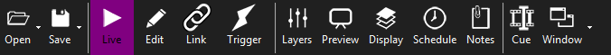
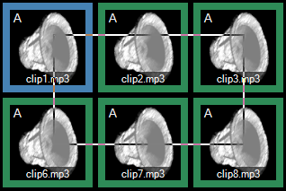
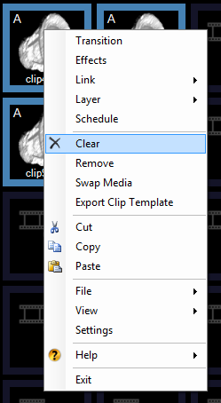

 
# Edit

You may find yourself wanting to change the settings of more than one clip at a time. This is where edit mode is handy. It allows you to select a number of clips and change the settings on all the selected clips in one go. When in edit mode you can change the effect, link and layer as well as remove the selected clips. Edit mode also allows you to quickly move clips and rearrange the dashboard.

## Edit Mode
- To enter edit mode click the pencil icon in the toolbar or press Ctrl+E
- To exit edit mode click the pencil icon again or choose a different mode from the toolbar

The toolbar icon background changes to purple to indicate edit mode and the clip borders turn green. You may now use the mouse to select a number of clips to be edited. 

## Selecting Clips
Clicking on a clip in edit mode does not have the normal action of playing that clip. Any clips you have selected will be highlighted in blue. You may select clips in a number of ways.

1. **Click** - Left click on a clip

2. **Lasso** - Click on the first clip and whilst keeping the mouse button pressed draw a box over all the clips you want to select. Then release the mouse button.   

3. **Click with Shift** - Click to select the first clip, press and hold Shift, then click to select the last clip. All clips in between will be selected.

4. **Click with Control** - Click to select the first clip. Hold Control (Ctrl) and click on any other clips you wish to select. These clips can be located anywhere on the page.

## De-Selecting Clips
Left clicking on a blue (selected) clip will remove it from the selection.
 
## Editing Multiple Clips
When you right-click the selection menu will only include items that apply to multiple clips.

## Removing clips
To quickly remove clips first select them using any of the methods above and then press the keyboard Delete or Backspace key.

## Moving Clips
When in edit mode you can move clips by selecting them and dragging them to a new position. You must first click the clip(s) to select, then click again to begin the click and drag process. You can drop the clip(s) on any empty space or on top of an existing clip. In this case the clips are simply reordered, nothing is removed.

If you are in list view then you can drag items in the list to re-order them. You can also drag items between [space clips](../clipTypes/CueListSpaceClip.md) and the main dashboard.
