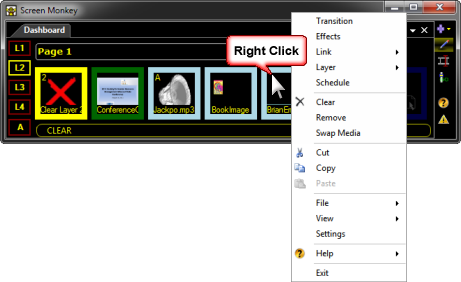

 
# Edit

You may find yourself wanting to change the settings of more than one clip at a time. This is where edit mode is handy. It allows you to select a number of clips and change the settings on all the selected clips in one go. When in edit mode you can change the effect, link and layer as well as remove the selected clips. Edit mode also allows you to quickly move clips and re-arrange the dashboard.

## Edit Mode
- To enter edit mode click the pencil icon in the toolbar or press Ctrl+E
- To exit edit mode click the pencil icon again or choose a different mode from the toolbar

The toolbar icon background changes to purple to indicate edit mode and the clip borders turn green. You may now use the mouse to select a number of clips to be edited. 

## Selecting Clips
Clicking on a clip in edit mode does not have the normal action of playing that clip. Any clips you have selected will be highlighted in blue. You may select clips in a number of ways.

### Click
- Left click on a clip

### Lassoo
- Click on the first clip a whilst keeping the mouse button pressed draw a box over all the clips you want to select. Then release the mouse button.

### Click with keyboard options
- Use standard Windows functionality to select the first clip, press and hold Shift, then click to select the last clip.

When you right-click the selection you will notice that you are presented with a different popup menu.

Once you have finished in edit mode, click on the pencil icon or press Ctrl+E to exit.

## Moving Clips

When in multi-edit mode you can move clips by selecting them and dragging them to a new position. Typically you must click the clip to select it, then click again to begin the click and drag process.

If you are in list view then you can drag items about in the list to re-order them. You can even drag items between spaces and the main dashboard.